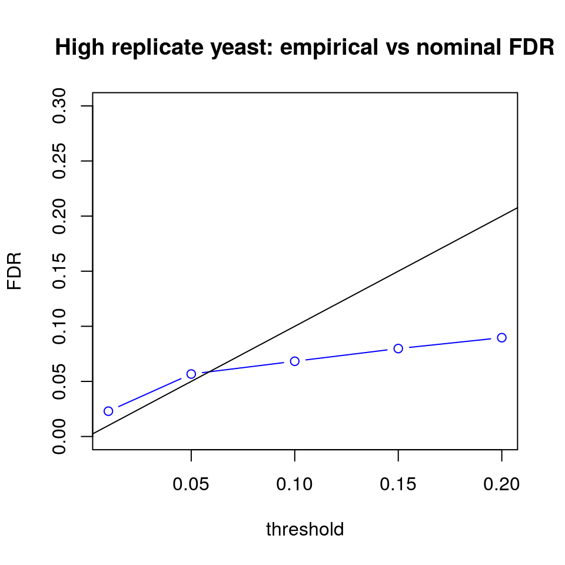

# Importing Salmon quant files

We begin this workflow by importing Salmon quantifications which are 
included in this repository under `data/quant`. Relative to the `scripts` 
directory, we can see we have quantifications for 24 samples:


```r
list.files("../data/quant/")
```

```
##  [1] "SRR1565926" "SRR1565927" "SRR1565928" "SRR1565929" "SRR1565930"
##  [6] "SRR1565931" "SRR1565932" "SRR1565933" "SRR1565934" "SRR1565935"
## [11] "SRR1565936" "SRR1565937" "SRR1565938" "SRR1565939" "SRR1565940"
## [16] "SRR1565941" "SRR1565942" "SRR1565943" "SRR1565944" "SRR1565945"
## [21] "SRR1565946" "SRR1565947" "SRR1565948" "SRR1565949"
```

The layout of a single sample's quantification directory


```r
list.files("../data/quant/SRR1565926")
```

```
## [1] "aux_info"               "cmd_info.json"         
## [3] "lib_format_counts.json" "libParams"             
## [5] "logs"                   "quant.sf.gz"
```

We will read in a table we created from the SRA website, which
gives some of the sample information. We call this table `coldata`,
because it provides data about the *columns* of the count matrix
we will be assembling.


```r
library(readr)
coldata <- read_delim("../data/SraRunTable.txt", delim="\t")
```

```
## Parsed with column specification:
## cols(
##   .default = col_character(),
##   LoadDate_s = col_date(format = ""),
##   MBases_l = col_integer(),
##   MBytes_l = col_integer(),
##   AvgSpotLen_l = col_integer(),
##   InsertSize_l = col_integer(),
##   ReleaseDate_s = col_date(format = ""),
##   passages_s = col_integer()
## )
```

```
## See spec(...) for full column specifications.
```

```r
coldata
```

```
## # A tibble: 24 x 27
##     BioSample_s Experiment_s LoadDate_s MBases_l MBytes_l      Run_s
##           <chr>        <chr>     <date>    <int>    <int>      <chr>
##  1 SAMN03020276    SRX692912 2015-12-02     1104      807 SRR1565926
##  2 SAMN03020277    SRX692913 2015-12-02     1098      805 SRR1565927
##  3 SAMN03020278    SRX692914 2015-12-02     1143      838 SRR1565928
##  4 SAMN03020279    SRX692915 2015-12-02     1178      863 SRR1565929
##  5 SAMN03020280    SRX692916 2015-12-02      934      683 SRR1565930
##  6 SAMN03020281    SRX692917 2015-12-02     1146      846 SRR1565931
##  7 SAMN03020282    SRX692918 2015-12-02     1128      830 SRR1565932
##  8 SAMN03020283    SRX692919 2015-12-02     1145      839 SRR1565933
##  9 SAMN03020284    SRX692920 2015-12-02     1106      815 SRR1565934
## 10 SAMN03020285    SRX692921 2015-12-02     1185      865 SRR1565935
## # ... with 14 more rows, and 21 more variables: SRA_Sample_s <chr>,
## #   Sample_Name_s <chr>, disease_state_s <chr>, treatment_s <chr>,
## #   Assay_Type_s <chr>, AvgSpotLen_l <int>, BioProject_s <chr>,
## #   Center_Name_s <chr>, Consent_s <chr>, InsertSize_l <int>,
## #   Instrument_s <chr>, LibraryLayout_s <chr>, LibrarySelection_s <chr>,
## #   LibrarySource_s <chr>, Organism_s <chr>, Platform_s <chr>,
## #   ReleaseDate_s <date>, SRA_Study_s <chr>, cell_type_s <chr>,
## #   passages_s <int>, source_name_s <chr>
```

We have used the run ID (`SRR...`) to keep track of the reads and quantifications,
so we can build a vector which points to our quantification files using
this column of `coldata`. We use `names` to name this vector with the run IDs as well.


```r
files <- file.path("../data/quant",coldata$Run_s,"quant.sf.gz")
names(files) <- coldata$Run_s
head(files,2)
```

```
##                             SRR1565926 
## "../data/quant/SRR1565926/quant.sf.gz" 
##                             SRR1565927 
## "../data/quant/SRR1565927/quant.sf.gz"
```

The following code (not evaluated here) can be used to generate a table
that connects transcripts to genes for summarizing Salmon transcript
quantifications for differential gene expression. We simply
read in the GTF file from the same database that we used for building
the Salmon index (in this case, Gencode version 26), and then pull
out a table with the transcript name for every gene.


```r
# ftp://ftp.sanger.ac.uk/pub/gencode/Gencode_human/release_26/gencode.v26.annotation.gtf.gz
library(GenomicFeatures)
txdb <- makeTxDbFromGFF("gencode.v26.annotation.gtf.gz")
saveDb(txdb, file="gencode.v26.sqlite")
# next time you can just load with this line (no need to makeTxDb...)
# txdb <- loadDb("gencode.v26.sqlite") 
columns(txdb)
k <- keys(txdb, "GENEID")
res <- AnnotationDbi::select(txdb, k, "TXNAME", "GENEID")
tx2gene <- res[,2:1]
```
	
We have prepared this table in advance, and now load it:
	

```r
load("../data/tx2gene.rda")
head(tx2gene)
```

```
##              TXNAME             GENEID
## 1 ENST00000612152.4 ENSG00000000003.14
## 2 ENST00000373020.8 ENSG00000000003.14
## 3 ENST00000614008.4 ENSG00000000003.14
## 4 ENST00000496771.5 ENSG00000000003.14
## 5 ENST00000494424.1 ENSG00000000003.14
## 6 ENST00000373031.4  ENSG00000000005.5
```

Now we can use the `tximport` function to assemble all the quantifications
from the 24 files, and to summarize the abundances, counts and transcript
lengths to the gene level, for use with DESeq2 and other Bioconductor
packages.

It's a good idea to first test on a single quantification file, which we show here:


```r
library(rjson)
library(tximport)
txi <- tximport(files[1], type="salmon", tx2gene=tx2gene)
```

```
## reading in files with read_tsv
```

```
## 1
```

```
## 
```

```
## summarizing abundance
```

```
## summarizing counts
```

```
## summarizing length
```

Now we can run `tximport` over all the quanfitication files.
We can see we obtain a list of matrices with common dimension:
58219 (the number of genes) x 24 (the number of samples).


```r
txi <- tximport(files, type="salmon", tx2gene=tx2gene)
names(txi)
```

```
## [1] "abundance"           "counts"              "length"             
## [4] "countsFromAbundance"
```

```r
dim(txi$abundance)
```

```
## [1] 58219    24
```

```r
dim(txi$counts)
```

```
## [1] 58219    24
```

```r
dim(txi$length)
```

```
## [1] 58219    24
```

Now we load DESeq2 for further steps in the workflow:


```r
library(DESeq2)
```

# Assembling the sample info

In the `coldata` table, we have information about which samples are from
asthmatic or non-asthmatic individuals, and which samples are control or treated.
Because we built `txi` using the run IDs, we know that these columns are
lined up with our columns of the matrices in `txi`.


```r
coldata$disease_state_s
```

```
##  [1] "asthmatic"     "asthmatic"     "asthmatic"     "asthmatic"    
##  [5] "asthmatic"     "asthmatic"     "asthmatic"     "asthmatic"    
##  [9] "asthmatic"     "asthmatic"     "asthmatic"     "asthmatic"    
## [13] "non-asthmatic" "non-asthmatic" "non-asthmatic" "non-asthmatic"
## [17] "non-asthmatic" "non-asthmatic" "non-asthmatic" "non-asthmatic"
## [21] "non-asthmatic" "non-asthmatic" "non-asthmatic" "non-asthmatic"
```

```r
coldata$treatment_s
```

```
##  [1] "HRV16"   "HRV16"   "HRV16"   "HRV16"   "HRV16"   "HRV16"   "Vehicle"
##  [8] "Vehicle" "Vehicle" "Vehicle" "Vehicle" "Vehicle" "HRV16"   "HRV16"  
## [15] "HRV16"   "HRV16"   "HRV16"   "HRV16"   "Vehicle" "Vehicle" "Vehicle"
## [22] "Vehicle" "Vehicle" "Vehicle"
```

While most of the information we need is in the `coldata` table already,
while preparing this data for analysis, I noticed that the same subjects had 
both a control (Vehicle) and treated (HRV16) sample, but I didn't find this
information from the SRA table. It was present, however, in the title of 
the samples listed on the GEO website, which also points to the run ID.
We can therefore bring in the sample names from GEO, line them up with
our coldata, and extract the subject ID information:


```r
geo <- read_delim("../data/GEO_table.txt", delim="\t", col_names=FALSE)
```

```
## Parsed with column specification:
## cols(
##   X1 = col_character(),
##   X2 = col_character()
## )
```

```r
head(geo)
```

```
## # A tibble: 6 x 2
##           X1        X2
##        <chr>     <chr>
## 1 GSM1498304 s12A24HRV
## 2 GSM1498305 s14A24HRV
## 3 GSM1498306 s28A24HRV
## 4 GSM1498307 s18A24HRV
## 5 GSM1498308 s15A24HRV
## 6 GSM1498309 s26A24HRV
```

```r
coldata$title <- geo$X2[match(coldata$Sample_Name_s, geo$X1)]
coldata$condition <- factor(coldata$disease_state_s)
coldata$treatment <- factor(coldata$treatment_s)
```

Now, we will build a `DESeqDataSet` from the matrices in `txi`, 
which we will use for the rest of the workflow. This function brings
along the estimated counts per gene, estimated by Salmon, as well as 
a normalizing offset based on the transcript lengths. This normalizing offset
adjusts for the *average transcript length* of a gene, which can be influenced
by differential isoform usage, as well as common RNA-seq biases,
if we used Salmon flags for correcting for various biases. Both of these effects 
-- differential isoform usage and technical biases -- 
can change the *effective length* of a gene, and so both are useful as
normalizing offsets in a statistical comparisons of counts across samples.

When building the `DESeqDataSet` we have to specify a *design*, which
is a formula in R that begins with a tilde and explains what terms, or coefficients,
we want to use to model the counts. The design is used by the dispersion estimation
and model fitting functions in DESeq2, so we can change it later, but we will have 
to rerun the main functions to re-estimate the parameters. 

For now, we will use a design that specifies a condition effect (asthmatics vs
non-asthmatics), a treatment effect (HRV16 vs Vehicle), and an interaction between 
the two (so the treatment effect can be different for asthmatics and non-asthmatics).
An interaction term is specified in R with a colon between two variables.
This design roughly corresponds to the goals of the original study.
The samples are human airway epithelial cells, and so we can expect to see a reaction
in these cells upon treatment with virus.


```r
dds <- DESeqDataSetFromTximport(txi, coldata,
                                ~condition + treatment + condition:treatment)
```

```
## using counts and average transcript lengths from tximport
```

```r
dds
```

```
## class: DESeqDataSet 
## dim: 58219 24 
## metadata(1): version
## assays(2): counts avgTxLength
## rownames(58219): ENSG00000000003.14 ENSG00000000005.5 ...
##   ENSG00000284596.1 ENSG00000284600.1
## rowData names(0):
## colnames(24): SRR1565926 SRR1565927 ... SRR1565948 SRR1565949
## colData names(30): BioSample_s Experiment_s ... condition
##   treatment
```

I like to rename the *levels* of the variables in the design so they are
easier to work with, by shortening them.


```r
# you can rename levels, but need to use same order as current levels()
levels(dds$condition)
```

```
## [1] "asthmatic"     "non-asthmatic"
```

```r
levels(dds$condition) <- c("asth","non")
levels(dds$condition)
```

```
## [1] "asth" "non"
```

```r
dds$condition
```

```
##  [1] asth asth asth asth asth asth asth asth asth asth asth asth non  non 
## [15] non  non  non  non  non  non  non  non  non  non 
## Levels: asth non
```

It's also important to set the *reference level* in a sensible way,
so comparisons are of treated over control for instance. In this 
case the reference levels should be the non-asthmatic individuals and the
Vehicle treatment.

We use the compound assignment operator `%<>%` from the magrittr package, 
which saves us a little extra typing, when we want to apply a function 
to a variable in R, and then re-assign it (so it is equivalent to `x <- f(x)`).


```r
library(magrittr)
dds$condition %<>% relevel("non")
dds$treatment %<>% relevel("Vehicle")
dds$condition
```

```
##  [1] asth asth asth asth asth asth asth asth asth asth asth asth non  non 
## [15] non  non  non  non  non  non  non  non  non  non 
## Levels: non asth
```

```r
dds$treatment
```

```
##  [1] HRV16   HRV16   HRV16   HRV16   HRV16   HRV16   Vehicle Vehicle
##  [9] Vehicle Vehicle Vehicle Vehicle HRV16   HRV16   HRV16   HRV16  
## [17] HRV16   HRV16   Vehicle Vehicle Vehicle Vehicle Vehicle Vehicle
## Levels: Vehicle HRV16
```

# Exploratory data analysis

Already, we can take a look at how the samples related to each other.
In DESeq2, we have special functions for transforming the counts,
so that they can be easily visualized (we will not transform the counts, 
but use the raw counts later, for statistical testing).

My favorite of these transformation is the `vst`, mostly because it is 
very fast, and provides transformed (nearly log-scale) data which is
robust to many problems associated with log-transformed data (for more details,
see the DESeq2 
[workflow ](http://www.bioconductor.org/help/workflows/rnaseqGene/#the-rlog-and-variance-stabilizing-transformations)
or 
[vignette](https://www.bioconductor.org/packages/release/bioc/vignettes/DESeq2/inst/doc/DESeq2.html#count-data-transformations)
).

`blind=FALSE` refers to the fact that we will use the *design* in estimating
the global scale of biological variability, but not directly in the transformation:


```r
vsd <- vst(dds, blind=FALSE)
```

```
## using 'avgTxLength' from assays(dds), correcting for library size
```

Now that we have normalized and transformed the data, it will have roughly 
the same variance (except for differentially expressed genes) across the range of
counts, so from counts in the single digits, up to the most highly expressed 
genes with very high counts.

We can make a PCA plot, which shows the distribution of the samples
among the top two dimensions, in terms of the variance explained.
It's simply a rotation and projection of the transformed data, but 
picking the "best" 2 dimensions out of the tens of thousands (number of genes).


```r
plotPCA(vsd, c("treatment","condition"))
```


From the PCA plot, we see that the treatment with HRV leads to the most
variance across samples, for the top variable genes. There seems to be some
clustering by disease status (what we called `condition`), for the treated samples
but not much for the control samples.

# Re-arrange sample info

As we mentioned before, there is an additional piece of information
about the samples: the Vehicle and HRV treated samples are from
the same individual, so this is also important information to include
in the design, if possible. In this case, because we are comparing
control and HRV treatment within individuals, we can add this information 
to the design. First, we need to clean up the sample ID information
contained in the `title` variable:


```r
dds$id <- substr(dds$title, 1, 3)
dds$id
```

```
##  [1] "s12" "s14" "s28" "s18" "s15" "s26" "s28" "s12" "s26" "s15" "s18"
## [12] "s14" "s30" "s23" "s20" "s11" "s22" "s21" "s21" "s23" "s20" "s22"
## [23] "s11" "s30"
```

```r
id.lvls <- c(dds$id[dds$condition == "non" & dds$treatment == "Vehicle"],
             dds$id[dds$condition == "asth" & dds$treatment == "Vehicle"])
id.lvls
```

```
##  [1] "s21" "s23" "s20" "s22" "s11" "s30" "s28" "s12" "s26" "s15" "s18"
## [12] "s14"
```

We will re-factor the id, so that the levels are in the order
of the `id.lvls` variable we just defined.

We will then re-order the `DESeqDataSet` so that the
samples are in order by condition, treatment and ID.


```r
dds$id %<>% factor(levels=id.lvls)
o <- order(dds$condition, dds$treatment, dds$id)
dds <- dds[,o]
```

We can take a look at the `colData` to confirm it's in the order
as we want it to be:


```r
as.data.frame(colData(dds)[c("condition","treatment","id")])
```

```
##            condition treatment  id
## SRR1565944       non   Vehicle s21
## SRR1565945       non   Vehicle s23
## SRR1565946       non   Vehicle s20
## SRR1565947       non   Vehicle s22
## SRR1565948       non   Vehicle s11
## SRR1565949       non   Vehicle s30
## SRR1565943       non     HRV16 s21
## SRR1565939       non     HRV16 s23
## SRR1565940       non     HRV16 s20
## SRR1565942       non     HRV16 s22
## SRR1565941       non     HRV16 s11
## SRR1565938       non     HRV16 s30
## SRR1565932      asth   Vehicle s28
## SRR1565933      asth   Vehicle s12
## SRR1565934      asth   Vehicle s26
## SRR1565935      asth   Vehicle s15
## SRR1565936      asth   Vehicle s18
## SRR1565937      asth   Vehicle s14
## SRR1565928      asth     HRV16 s28
## SRR1565926      asth     HRV16 s12
## SRR1565931      asth     HRV16 s26
## SRR1565930      asth     HRV16 s15
## SRR1565929      asth     HRV16 s18
## SRR1565927      asth     HRV16 s14
```

```r
all(dds$id == c(rep(id.lvls[1:6], 2),
                rep(id.lvls[7:12], 2)))
```

```
## [1] TRUE
```

To make the within-individual treatment comparisons across 
condition, we need to do a little re-coding trick for the 
subject ID. We will re-code them so that the first asthmatic 
subject is called `1`, and the first non-asthmatic subject 
is also called `1`, which we call "nesting". 

Note that these two subjects will 
not be treated as the same in the model, because we will
include an interaction term between `condition` and `id.nested`.


```r
dds$id.nested <- factor(rep(1:6,4))
as.data.frame(colData(dds)[c("condition","treatment","id","id.nested")])
```

```
##            condition treatment  id id.nested
## SRR1565944       non   Vehicle s21         1
## SRR1565945       non   Vehicle s23         2
## SRR1565946       non   Vehicle s20         3
## SRR1565947       non   Vehicle s22         4
## SRR1565948       non   Vehicle s11         5
## SRR1565949       non   Vehicle s30         6
## SRR1565943       non     HRV16 s21         1
## SRR1565939       non     HRV16 s23         2
## SRR1565940       non     HRV16 s20         3
## SRR1565942       non     HRV16 s22         4
## SRR1565941       non     HRV16 s11         5
## SRR1565938       non     HRV16 s30         6
## SRR1565932      asth   Vehicle s28         1
## SRR1565933      asth   Vehicle s12         2
## SRR1565934      asth   Vehicle s26         3
## SRR1565935      asth   Vehicle s15         4
## SRR1565936      asth   Vehicle s18         5
## SRR1565937      asth   Vehicle s14         6
## SRR1565928      asth     HRV16 s28         1
## SRR1565926      asth     HRV16 s12         2
## SRR1565931      asth     HRV16 s26         3
## SRR1565930      asth     HRV16 s15         4
## SRR1565929      asth     HRV16 s18         5
## SRR1565927      asth     HRV16 s14         6
```

Now we update the design, so that each patient gets his or her 
own reference level for comparison of the treatment effect:


```r
design(dds) <- ~condition + condition:id.nested +
  treatment + condition:treatment
```

Before we run the differential expression steps,
we have one more data cleaning step to do. We will 
chop off the version number of the gene IDs, so that we 
can better look up their annotation information later.

However, we have a few genes which would have duplicated
gene IDs after chopping off the version number, so in order
to proceed we have to also use `make.unique` to indicate 
that some genes are duplicated. (It might be 
worth looking into why we have multiple versions of genes
with the same base ID coming from our annotation.)


```r
head(rownames(dds))
```

```
## [1] "ENSG00000000003.14" "ENSG00000000005.5"  "ENSG00000000419.12"
## [4] "ENSG00000000457.13" "ENSG00000000460.16" "ENSG00000000938.12"
```

```r
table(duplicated(substr(rownames(dds),1,15)))
```

```
## 
## FALSE  TRUE 
## 58174    45
```

```r
rownames(dds) <- make.unique(substr(rownames(dds),1,15))
```

# Differential gene expression

Now we can run our differential expression pipeline.
First, it is sometimes convenient to remove genes where
all the samples have very small counts. It's less of an issue 
for the statistical methods, and mostly just wasted computation,
as it is not possible for these genes to exhibit statistical
significance for differential expression. Here we count
how many genes (out of those with at least a single count)
have 3 samples with a count of 10 or more:


```r
dds <- dds[rowSums(counts(dds)) > 0,]
keep <- rowSums(counts(dds) >= 10) >= 3
table(keep)
```

```
## keep
## FALSE  TRUE 
## 20042 11227
```

```r
dds <- dds[keep,] # filter them out
```

Now we can run the differential expression pipeline using
`DESeq` and extract the results using `results`.
These functions do a little of work for you, and
they have extensive help describing all their options,
which can be read by typing in `?DESeq` and `?results`.

We will build a results table for the coefficient
`conditionasth.treatmentHRV16`. This coefficient represents
the difference in the treatment effect in the asthmatic group
relative to the non-asthmatic group.


```r
dds <- DESeq(dds)
```

```
## estimating size factors
```

```
## using 'avgTxLength' from assays(dds), correcting for library size
```

```
## estimating dispersions
```

```
## gene-wise dispersion estimates
```

```
## mean-dispersion relationship
```

```
## final dispersion estimates
```

```
## fitting model and testing
```

```r
resultsNames(dds)
```

```
##  [1] "Intercept"                    "condition_asth_vs_non"       
##  [3] "treatment_HRV16_vs_Vehicle"   "conditionnon.id.nested2"     
##  [5] "conditionasth.id.nested2"     "conditionnon.id.nested3"     
##  [7] "conditionasth.id.nested3"     "conditionnon.id.nested4"     
##  [9] "conditionasth.id.nested4"     "conditionnon.id.nested5"     
## [11] "conditionasth.id.nested5"     "conditionnon.id.nested6"     
## [13] "conditionasth.id.nested6"     "conditionasth.treatmentHRV16"
```

```r
res <- results(dds, name="conditionasth.treatmentHRV16")
res.sort <- res[order(res$pvalue),]
```

# Exploring results

A good visual summary of a results table is the "MA-plot".
M stands for "minus", as the y-axis for a simple two group
comparison is the difference between the log of the expression
values for each group. In general, and for this experiment, the y-axis
is the log2 fold change attributable to the coefficient or contrast
that was used in building the results table. The "A" stands for average,
as the x-axis indicates the average of normalized counts across 
all the samples in the dataset.

Because all of the points are grey, we know that none of the 
genes showed a significant difference in the treatment effect
across the two condition groups, at an FDR cutoff of 0.1 
(this is the default value for `plotMA`, and can be changed).


```r
plotMA(res, ylim=c(-5,5))
```


We can also print out a summary table, which 
similarly tells us that, at an FDR cutoff of 0.1,
no genes were significantly differentially expressed
for our particular comparison.


```r
summary(res)
```

```
## 
## out of 11227 with nonzero total read count
## adjusted p-value < 0.1
## LFC > 0 (up)     : 0, 0% 
## LFC < 0 (down)   : 0, 0% 
## outliers [1]     : 0, 0% 
## low counts [2]   : 0, 0% 
## (mean count < 2)
## [1] see 'cooksCutoff' argument of ?results
## [2] see 'independentFiltering' argument of ?results
```


While we didn't get any genes at an FDR cutoff of 0.1, we can
look at the top gene by adjusted p-value, in 
terms of the normalized counts in the different groups.

There does seem to be a trend of downregulation of this gene
for non-asthmatics, and up-regulation for asthmatics, 
but generally the fold changes across treatment are not very
consistent within conditions.

We've added the ID within each condition as a plotting character
`pch`:


```r
top.gene <- rownames(res.sort)[1]
plotCounts(dds, top.gene, c("condition","treatment"), 
           transform=FALSE, pch=as.integer(dds$id.nested))
```


We can also make a plot which draws lines
between the expression values across treatment for a given sample.
To do so, we need to use the `ggplot2` library. First, we 
export a little table of the counts and design variables 
for the top gene:


```r
dat <- plotCounts(dds, top.gene, c("condition","treatment","id.nested"),
                  returnData=TRUE)
```

Next we form the `ggplot2` code, using points and a smooth line
to connect the points for each ID in each condition group.
It makes sense that this is the top gene for testing different slope
across condition, but the slopes are not entirely consistent
across the samples within a condition, which explains why
it's not more significant in the hypothesis test.


```r
library(ggplot2)
ggplot(dat, aes(x=treatment, y=count, col=id.nested, group=id.nested)) +
  geom_point() + geom_smooth(method="lm", se=FALSE) +
  scale_y_log10() + 
  facet_wrap(~condition)
```


We can look up the gene symbol for the top gene using an annotation package.
These packages have a number of functions for pulling out annotations,
here we will show the `mapIds` function and the `select` function.
`select` is the name for a function in the `dplyr` package,
so we have to use the package prefix `AnnotationDbi::` to call
our version of `select`.

The other command is for looking up gene ontology terms for the top gene, 
specifically terms that are classified as biological processes (BP).
We will explore GO terms further in a later section of this workflow.


```r
library(Homo.sapiens)
Homo.sapiens %>% mapIds(top.gene, "SYMBOL", "ENSEMBL")
```

```
## 'select()' returned 1:1 mapping between keys and columns
```

```
## ENSG00000006025 
##        "OSBPL7"
```

```r
go.tab <- Homo.sapiens %>% AnnotationDbi::select(top.gene, "GOID", "ENSEMBL") %>% subset(ONTOLOGY == "BP")
```

```
## 'select()' returned 1:many mapping between keys and columns
```

```r
go.tab
```

```
##            ENSEMBL EVIDENCE ONTOLOGY       GOID
## 7  ENSG00000006025      TAS       BP GO:0006699
## 8  ENSG00000006025      NAS       BP GO:0010506
## 11 ENSG00000006025      IEA       BP GO:0015918
## 12 ENSG00000006025      IMP       BP GO:0071397
## 14 ENSG00000006025      IMP       BP GO:1901800
```

A number of gene symbols were listed in the abstract of the paper 
(one of which we swapped here for a more common gene symbol).
We can do a reverse lookup, to see where they are showing up
in our list of ranked genes:


```r
target <- c("CCL5","CXCL10","CX3CL1","ACKR4","CDHR3")
target.map <- mapIds(Homo.sapiens, target, "ENSEMBL", "SYMBOL")
```

```
## 'select()' returned 1:many mapping between keys and columns
```

```r
target.map
```

```
##              CCL5            CXCL10            CX3CL1             ACKR4 
## "ENSG00000271503" "ENSG00000169245" "ENSG00000006210" "ENSG00000129048" 
##             CDHR3 
## "ENSG00000128536"
```

```r
match(target.map, rownames(res.sort))
```

```
## [1] 2747  253 4704  335 8628
```

Let's take a look at the counts for the second gene symbol from above:


```r
plotCounts(dds, target.map[2], c("condition","treatment"))
```


```r
plotCounts(dds, target.map[2], c("condition","treatment"), transform=FALSE)
```


# Interlude: power analysis

With your standard t-test or linear regression on a one dimensional *Y*, 
performing a post-hoc power analysis doesn't make sense, because the observed effect
size and variance estimate functionally determine the estimated power just as 
they do the observed p-value. In other words, it's entirely 
circular to show that with a standard power analysis formula,
using the post-hoc observed effect size and variance, it will say 
the experiment was "under-powered", if you have an observed 
p-value above your critical threshold (and the converse). 
It makes more sense to perform power analyses for a range of effect sizes, 
and using your best estimate of within-group variance.

Here we will do something a little different, we will assess via 
simulation what range of effect sizes and count ranges would have
been significant, given the observed variance of counts.
We will work with a value called *dispersion* which links
the variance to the mean in a negative binomial distribution 
(this is the distribution used to model counts in DESeq2).
Roughly, the dispersion is the square of the coefficient of
variation of counts. So dipersion of 0.01 implies that the counts
might vary by about 10% around their mean value.


```r
sqrt(.01)
```

```
## [1] 0.1
```

DESeq2 estimates dispersion values for each gene, first a 
*maximum likelihood value*, and then a *maximum posterior* value.
For full details, you can take a look at the 
[DESeq2 paper](https://genomebiology.biomedcentral.com/articles/10.1186/s13059-014-0550-8), 
but briefly, the maximum likelihood value just looks at the data for a single
gene, while the maximum posterior value integrates the information
from the individual gene with the information about all the genes.
If the maximum likelihood estimate for a single gene 
differs greatly from the estimates of the majority of the other genes,
that gene's estimate will be "pulled in" or "shrunk" towards the estimates 
of the others. It's not shrunk all the way, and the amount is determined
by a formula called *Bayes formula*. It can be shown that these posterior
estimates have less error overall than the maximum likelihood estimates,
if we structure the formula in the right way. They end up preventing
a lot of false positives, where we might by chance have a 
too-small dispersion estimate for some genes, in particular when 
the sample sizes are small.

Here we can plot the dispersion estimates for this dataset.
The black points are the maximum likelihood estimates ("gene-est"),
and the blue points are the maximum posterior estimates ("final").


```r
plotDispEsts(dds, ylim=c(1e-4,10))
```


We can extract information about how the trend and how the values 
clustered around the trend. We will write an R function
that takes in a mean normalized count, and outputs
a plausible dispersion value for this dataset.
The `.05` and `2.06` come from the coefficients for the red line,
and the `.28` comes from determining how far the true dispersion values
are spread around the red line. It's less than the black points,
as the spread of the black points represents dispersion differences 
across genes *and* sampling variance.

The `.05` *asymptotic dispersion* means that the counts
vary by about 22% of their expected value, when the counts are high.


```r
dispersionFunction(dds)
```

```
## function (q) 
## coefs[1] + coefs[2]/q
## <bytecode: 0x12059a4e8>
## <environment: 0x1268f7120>
## attr(,"coefficients")
## asymptDisp  extraPois 
## 0.05393587 2.06449016 
## attr(,"fitType")
## [1] "parametric"
## attr(,"varLogDispEsts")
## [1] 0.5016665
## attr(,"dispPriorVar")
## [1] 0.2803435
```

```r
dmr <- function(x) (.05 + 2.06 / x) * exp(rnorm(length(x),0,.28))
```

This is what our `dmr` function returns, when we
feed in the mean of normalized counts from the dataset.


```r
baseMean <- mcols(dds)$baseMean
plot(baseMean, dmr(baseMean), log="xy", ylim=c(1e-4,10))
```


We can see what the mean and standard deviation
of the log2 of mean counts was. Note that this
experiment had much lower sequencing depth than 
is typical for a human RNA-seq dataset. Typically, 
total counts of 20-40 million are common. This
dataset has about 1/10 of that. The mean count is about
`2^5` or 32.


```r
mean(log2(baseMean))
```

```
## [1] 4.802675
```

```r
sd(log2(baseMean))
```

```
## [1] 1.665009
```

There is a function in DESeq2 to simulate a dataset
according to parameters estimated from another dataset.
Note that, while the previous experiment had a complex
design structure including control for subject and condition,
here we just simulate a two group analysis for
simplicity. We simulate 10,000 genes with 12 samples across two groups,
and supposing that the true log2 fold changes are centered at 
0 with a standard deviation of 1. This means that fold changes
of 1/2 or 2 are common. This will allow us to see how high
the fold changes will need to be to end up in the set of
differentially expressed genes.


```r
set.seed(1)
sim <- makeExampleDESeqDataSet(n=10000, m=12,
                               betaSD=1,
                               interceptMean=5,
                               interceptSD=2,
                               dispMeanRel=dmr)
keep <- rowSums(counts(sim) >= 10) >= 3
table(keep)
```

```
## keep
## FALSE  TRUE 
##  1249  8751
```

```r
sim <- sim[keep,]
sim <- DESeq(sim)
```

```
## estimating size factors
```

```
## estimating dispersions
```

```
## gene-wise dispersion estimates
```

```
## mean-dispersion relationship
```

```
## final dispersion estimates
```

```
## fitting model and testing
```

```r
sim.res <- results(sim, independentFiltering=FALSE, cooksCutoff=FALSE)
```

We can plot the MA plot from our data, with the simulated data 
side-by-side. With the caveat that the experimental designs are 
not the same, in the simulated data we can see that large fold
changes are detected as differentially expressed at 10% FDR,
and that this depends on the mean count value. For the smallest 
mean count genes, the fold change needs to be larger for
the gene to end up in the significant set.


```r
par(mfrow=c(1,2))
plotMA(res, xlim=c(1,1e6), ylim=c(-5,5))
plotMA(sim.res, xlim=c(1,1e6), ylim=c(-5,5))
```


We can use `dplyr` and `ggplot2` to perform a more in depth
comparison of the power at various levels of effect size (log2 fold change)
and mean count. Because we simulated the data, we can use
the true log2 fold change and true mean value for the "control"
group, in order to classify the genes into bins.


```r
max.lfc <- ceiling(max(abs(mcols(sim)$trueBeta)))
sim.dat <- data.frame(sig=sim.res$padj < .1,
                      mean=cut(2^mcols(sim)$trueIntercept,c(0,10,100,1000,1e5)),
                      abs.LFC=cut(abs(mcols(sim)$trueBeta),c(0,.25,.5,1,max.lfc)))
```

We group the genes by the mean value and absolute fold change, and calculate the
statistical power in terms of number of times the adjusted p-values 
are less than 0.1 (and the genes would end up in the significant set).


```r
library(dplyr) 
sim.tab <- sim.dat %>% group_by(mean, abs.LFC) %>% summarize(power=mean(sig))
```

Plotting these power curves, we can see that the power is low for genes 
with small absolute LFC and genes with small mean count. To achieve
75% power for detection, the log2 fold change for a gene with mean count
in the range 10-100 needs to be greater than 1.


```r
ggplot(sim.tab, aes(x=abs.LFC, y=power, col=mean, group=mean)) + geom_line()
```


While we have our dispersion-mean function, we can see how DESeq2
performs when many of the genes are *null*, that is the log2 fold
change is exactly equal to 0. We simulate another dataset,
with 80% of null genes and a wider spread of mean counts.


```r
de <- rep(c(FALSE,TRUE),c(8000,2000))
set.seed(1)
sim2 <- makeExampleDESeqDataSet(n=10000, m=12,
                                betaSD=ifelse(de,1,0),
                                interceptMean=6,
                                interceptSD=3,
                                dispMeanRel=dmr)
sim2 <- DESeq(sim2)
```

```
## estimating size factors
```

```
## estimating dispersions
```

```
## gene-wise dispersion estimates
```

```
## mean-dispersion relationship
```

```
## final dispersion estimates
```

```
## fitting model and testing
```

We can then see how many null genes end up in FDR sets at
increasing cutoffs.


```r
threshold <- c(1,5,10,15,20)/100
FDR <- sapply(threshold, function(t) {
  sim2.res <- results(sim2, alpha=t)
  sig <- which(sim2.res$padj < t)
  mean(!de[sig])
})
```

The rate of null genes is roughly on target with the 
*nominal* amount, that is, the amount of false discovery
rate we asked for.


```r
plot(threshold, FDR, ylim=c(0,.3), type="b", col="blue",
     main="Sim: empirical vs nominal FDR")
abline(0,1)
```


We can also do a quick power and precision analysis of 
DESeq2 calls using the highly replicated yeast RNA-seq dataset of 
[Schurch et al.](https://www.ncbi.nlm.nih.gov/pmc/articles/PMC4878611/).
This dataset, designed for benchmarking RNA-seq for power analysis,
has more than 40 biological replicates in two condition, one of 
wild type yeast and a mutant strain, *Δsnf2*.


```r
load("../data/yeast.rda")
dim(yeast)
```

```
## [1] 7126   86
```

```r
table(yeast$condition)
```

```
## 
##  WT mut 
##  42  44
```

We can compare an analysis with 5 samples randomly drawn from each group,
with the results from running an analysis on the held-out samples. We would
expect that with 37-39 samples in the held-out set, we are close to finding 
all the differentially expressed genes, and so this can be considered a 
"gold standard" set.


```r
n <- 5
set.seed(1)
idx <- c(sample(which(yeast$condition == "WT"), n),
         sample(which(yeast$condition == "mut"), n))
yeast.in <- yeast[,idx]
yeast.out <- yeast[,-idx]
yeast.in <- DESeq(yeast.in)
```

```
## estimating size factors
```

```
## estimating dispersions
```

```
## gene-wise dispersion estimates
```

```
## mean-dispersion relationship
```

```
## final dispersion estimates
```

```
## fitting model and testing
```

```r
yeast.out <- DESeq(yeast.out)
```

```
## estimating size factors
```

```
## estimating dispersions
```

```
## gene-wise dispersion estimates
```

```
## mean-dispersion relationship
```

```
## final dispersion estimates
```

```
## fitting model and testing
```

The mutation in this experiment results in the majority of genes having small, 
statistically significant fold changes, so it's a bit too easy 
if we would look to see which genes are common across the two
analyses. We will require that the log2 fold changes show statistical
evidence of being larger than 1 in absolute value. And we will
require that a low FDR cutoff in the held-out set, 1%, because we 
think that we have sufficient replicates (37-39), to have sufficient power
to detect these genes.


```r
res.in <- results(yeast.in, lfcThreshold=1, alpha=.1)
res.out <- results(yeast.out, lfcThreshold=1, alpha=.01)
res.out$padj[is.na(res.out$padj)] <- 1 # set NA to 1
de <- res.out$padj < .01 # consider 'out' with 1% FDR as 'truth'
prop.table(table(test=res.in$padj < .1, de),1)
```

```
##        de
## test         FALSE       TRUE
##   FALSE 0.98675098 0.01324902
##   TRUE  0.06829268 0.93170732
```

We can look to see how many genes in the subset are called at various
FDR thresholds, and then we calculate the number of "null" genes,
that is, genes which do not show statistical evidence of having an LFC
larger than 1 in absolute value in the held-out set:


```r
sapply(threshold, function(t) {
  res.in <- results(yeast.in, lfcThreshold=1, alpha=t)
  sum(res.in$padj < t, na.rm=TRUE)
})
```

```
## [1] 174 194 205 213 223
```

```r
FDR <- sapply(threshold, function(t) {
  res.in <- results(yeast.in, lfcThreshold=1, alpha=t)
  sig <- which(res.in$padj < t)
  mean(!de[sig])
})
```

From this analysis, DESeq2 is close to the target for
low cutoffs, but then as we build larger sets with higher
cutoff values, we have lower FDR than nominal for the test of 
LFC greater than 1.


```r
plot(threshold, FDR, ylim=c(0,.3), type="b", col="blue",
     main="High replicate yeast: empirical vs nominal FDR")
abline(0,1)
```



# Other differential analyses

Now that we've taken a look at how power depends on effect size and mean count 
(among other things like design, number of replicates and dispersion),
let's return to our dataset, and try different statistical analyses,
besides the test of differences across condition in the treatment effect.

We didn't seem to see much of a difference in the treatment effect
across condition, so we can try another design, in which we estimate
the same treatment effect in both conditions, comparing within
subjects.


```r
dds2 <- removeResults(dds)
design(dds2) <- ~condition + treatment + condition:id.nested
dds2 <- DESeq(dds2)
```

```
## using pre-existing normalization factors
```

```
## estimating dispersions
```

```
## found already estimated dispersions, replacing these
```

```
## gene-wise dispersion estimates
```

```
## mean-dispersion relationship
```

```
## final dispersion estimates
```

```
## fitting model and testing
```

```r
resultsNames(dds2)
```

```
##  [1] "Intercept"                  "condition_asth_vs_non"     
##  [3] "treatment_HRV16_vs_Vehicle" "conditionnon.id.nested2"   
##  [5] "conditionasth.id.nested2"   "conditionnon.id.nested3"   
##  [7] "conditionasth.id.nested3"   "conditionnon.id.nested4"   
##  [9] "conditionasth.id.nested4"   "conditionnon.id.nested5"   
## [11] "conditionasth.id.nested5"   "conditionnon.id.nested6"   
## [13] "conditionasth.id.nested6"
```

```r
res2 <- results(dds2, name="treatment_HRV16_vs_Vehicle")
```

The above results table is equivalent, produced with the `name` argument
is equivalent to using the `contrast` argument, and providing
the numerator and denominator for the contrast:


```r
res2 <- results(dds2, contrast=c("treatment","HRV16","Vehicle"))
```

We can again make an MA plot, and notice that there are now
many genes which show large and significant log2 fold changes.
Also, one can see that most of the genes with log2 fold change 
larger than 2 in absolute value are in the top, meaning
that we are seeing genes with large up-regulation upon HRV treatment.


```r
plotMA(res2, ylim=c(-10,10))
```


```r
summary(res2)
```

```
## 
## out of 11227 with nonzero total read count
## adjusted p-value < 0.1
## LFC > 0 (up)     : 2240, 20% 
## LFC < 0 (down)   : 2429, 22% 
## outliers [1]     : 0, 0% 
## low counts [2]   : 0, 0% 
## (mean count < 2)
## [1] see 'cooksCutoff' argument of ?results
## [2] see 'independentFiltering' argument of ?results
```

We will take a look at the genes with large, positive log2 fold change
(greater than 2), and sort by the log2 fold change.

Looking at the gene names, some of the symbols look familiar, 
e.g. the ones with `CXCL...` and `CCL5`. These genes code for chemokines,
which are signaling molecules in the cell, and it makes sense to see these
up-regulated after treatment with virus, as the cells are mounting an
immune defense.


```r
res2.up <- results(dds2, name="treatment_HRV16_vs_Vehicle", 
                   lfcThreshold=1, altHypothesis="greater")
res2.up <- res2.up[res2.up$padj < .1,]
res2.sort <- res2.up[order(res2.up$log2FoldChange, decreasing=TRUE),]
Homo.sapiens %>% mapIds(rownames(res2.sort)[1:40],
                        "SYMBOL", "ENSEMBL")
```

```
## 'select()' returned 1:many mapping between keys and columns
```

```
## ENSG00000169245 ENSG00000169248 ENSG00000182393 ENSG00000183709 
##        "CXCL10"        "CXCL11"         "IFNL1"         "IFNL2" 
## ENSG00000138755 ENSG00000197110 ENSG00000271503 ENSG00000119922 
##         "CXCL9"         "IFNL3"          "CCL5"         "IFIT2" 
## ENSG00000226025 ENSG00000124256 ENSG00000135114 ENSG00000102524 
##      "LGALS17A"          "ZBP1"          "OASL"      "TNFSF13B" 
## ENSG00000215115 ENSG00000007171 ENSG00000215113 ENSG00000185745 
##       "CXorf49"          "NOS2"      "CXorf49B"         "IFIT1" 
## ENSG00000104951 ENSG00000119917 ENSG00000187608 ENSG00000185338 
##         "IL4I1"         "IFIT3"         "ISG15"         "SOCS1" 
## ENSG00000131203 ENSG00000134321 ENSG00000128383 ENSG00000107201 
##          "IDO1"         "RSAD2"      "APOBEC3A"         "DDX58" 
## ENSG00000010030 ENSG00000124391 ENSG00000232810 ENSG00000162654 
##          "ETV7"         "IL17C"           "TNF"          "GBP4" 
## ENSG00000089692 ENSG00000182487 ENSG00000138646 ENSG00000146192 
##          "LAG3"         "NCF1B"         "HERC5"          "FGD2" 
## ENSG00000144596 ENSG00000115267 ENSG00000168062 ENSG00000183486 
##         "GRIP2"         "IFIH1"         "BATF2"           "MX2" 
## ENSG00000167916 ENSG00000165178 ENSG00000117013 ENSG00000137198 
##         "KRT24"         "NCF1C"         "KCNQ4"          "GMPR"
```

Note that some of the top genes from the abstract are high on this list
of genes differentially expressed upon viral treatment.


```r
match(target.map, rownames(res2.sort))
```

```
## [1]   7   1  94 266  NA
```

# Exploring results with annotation

We can dive deeper into the top genes, by looking up
what biological processes these are associated with.


```r
go.tab <- Homo.sapiens %>% AnnotationDbi::select(rownames(res2.sort)[1],
                                  "GO", "ENSEMBL") %>% subset(ONTOLOGY == "BP")
```

```
## 'select()' returned 1:many mapping between keys and columns
```

```r
go.tab
```

```
##            ENSEMBL         GO EVIDENCE ONTOLOGY
## 6  ENSG00000169245 GO:0006935      IDA       BP
## 7  ENSG00000169245 GO:0006954      IBA       BP
## 8  ENSG00000169245 GO:0006955      IBA       BP
## 9  ENSG00000169245 GO:0007165      TAS       BP
## 10 ENSG00000169245 GO:0007166      TAS       BP
## 11 ENSG00000169245 GO:0007186      IMP       BP
## 12 ENSG00000169245 GO:0007267      TAS       BP
## 13 ENSG00000169245 GO:0007517      TAS       BP
## 15 ENSG00000169245 GO:0008015      TAS       BP
## 17 ENSG00000169245 GO:0008284      IEA       BP
## 19 ENSG00000169245 GO:0009409      IEA       BP
## 21 ENSG00000169245 GO:0010332      IEA       BP
## 22 ENSG00000169245 GO:0010818      IMP       BP
## 23 ENSG00000169245 GO:0010819      IDA       BP
## 24 ENSG00000169245 GO:0010996      IEA       BP
## 25 ENSG00000169245 GO:0016525      IEA       BP
## 26 ENSG00000169245 GO:0030816      IDA       BP
## 27 ENSG00000169245 GO:0033280      IEA       BP
## 28 ENSG00000169245 GO:0034605      IEA       BP
## 29 ENSG00000169245 GO:0042118      IGI       BP
## 30 ENSG00000169245 GO:0042127      IDA       BP
## 31 ENSG00000169245 GO:0043950      IDA       BP
## 32 ENSG00000169245 GO:0045662      IEA       BP
## 33 ENSG00000169245 GO:0045859      IEA       BP
## 34 ENSG00000169245 GO:0045944      TAS       BP
## 36 ENSG00000169245 GO:0051281      IDA       BP
## 37 ENSG00000169245 GO:0051607      IEA       BP
## 38 ENSG00000169245 GO:0070098      IMP       BP
## 39 ENSG00000169245 GO:0071222      IMP       BP
## 40 ENSG00000169245 GO:0090026      IDA       BP
## 41 ENSG00000169245 GO:1901509      IDA       BP
## 42 ENSG00000169245 GO:1901740      IEA       BP
## 43 ENSG00000169245 GO:2000406      IDA       BP
```

Now that we have associated this gene with a set of GO terms, we can look up
their names. Sometimes the names are very long, so to fit on the screen
we will chop the name at 60 characters.

The biological processes have names like "inflamation response", "immune response",
"response to cold", and "defense response to virus", which make sense.

A statistical rigorous approach, if we didn't have any terms in mind, would
be to perform a *battery* of statistical tests of all GO biological process 
terms. Sometimes, you might consider all GO terms within a range by size, 
e.g. GO BP terms with >= 10 and <= 500 genes.

Some packages and functions for performing gene set testing are 
[goseq](http://bioconductor.org/packages/goseq),
*roast*, and *camera*, the last two which are in the 
[limma](http://bioconductor.org/packages/limma) 
package.


```r
library(GO.db)
go.tab2 <- GO.db %>% AnnotationDbi::select(go.tab$GO, "TERM", "GOID")
```

```
## 'select()' returned 1:1 mapping between keys and columns
```

```r
substr(go.tab2$TERM, 1, 60)
```

```
##  [1] "chemotaxis"                                                  
##  [2] "inflammatory response"                                       
##  [3] "immune response"                                             
##  [4] "signal transduction"                                         
##  [5] "cell surface receptor signaling pathway"                     
##  [6] "G-protein coupled receptor signaling pathway"                
##  [7] "cell-cell signaling"                                         
##  [8] "muscle organ development"                                    
##  [9] "blood circulation"                                           
## [10] "positive regulation of cell proliferation"                   
## [11] "response to cold"                                            
## [12] "response to gamma radiation"                                 
## [13] "T cell chemotaxis"                                           
## [14] "regulation of T cell chemotaxis"                             
## [15] "response to auditory stimulus"                               
## [16] "negative regulation of angiogenesis"                         
## [17] "positive regulation of cAMP metabolic process"               
## [18] "response to vitamin D"                                       
## [19] "cellular response to heat"                                   
## [20] "endothelial cell activation"                                 
## [21] "regulation of cell proliferation"                            
## [22] "positive regulation of cAMP-mediated signaling"              
## [23] "negative regulation of myoblast differentiation"             
## [24] "regulation of protein kinase activity"                       
## [25] "positive regulation of transcription from RNA polymerase II "
## [26] "positive regulation of release of sequestered calcium ion in"
## [27] "defense response to virus"                                   
## [28] "chemokine-mediated signaling pathway"                        
## [29] "cellular response to lipopolysaccharide"                     
## [30] "positive regulation of monocyte chemotaxis"                  
## [31] "regulation of endothelial tube morphogenesis"                
## [32] "negative regulation of myoblast fusion"                      
## [33] "positive regulation of T cell migration"
```

We can write a function which prints out the GO term names for a given gene in our
results table:


```r
getTerms <- function(n) {
  go.tab <- Homo.sapiens %>% AnnotationDbi::select(rownames(res2.sort)[n],
                                    "GO", "ENSEMBL") %>% subset(ONTOLOGY == "BP")
  go.tab2 <- Homo.sapiens %>% AnnotationDbi::select(go.tab$GO, "TERM", "GOID")
  substr(go.tab2$TERM, 1, 60)
}
```

We see a lot of these immune response terms, but again
the proper way to do this would be (1) to have a specific
process in mind (no peeking at these lists first),
or (2) to test against a battery of GO-defined gene sets
of a certain size.


```r
getTerms(2)
```

```
## 'select()' returned 1:many mapping between keys and columns
```

```
## 'select()' returned 1:1 mapping between keys and columns
```

```
##  [1] "positive regulation of leukocyte chemotaxis"                 
##  [2] "chemotaxis"                                                  
##  [3] "inflammatory response"                                       
##  [4] "immune response"                                             
##  [5] "signal transduction"                                         
##  [6] "G-protein coupled receptor signaling pathway"                
##  [7] "cell-cell signaling"                                         
##  [8] "T cell chemotaxis"                                           
##  [9] "positive regulation of cAMP metabolic process"               
## [10] "response to lipopolysaccharide"                              
## [11] "regulation of cell proliferation"                            
## [12] "positive regulation of cAMP-mediated signaling"              
## [13] "positive regulation of release of sequestered calcium ion in"
## [14] "chemokine-mediated signaling pathway"
```

```r
getTerms(3)
```

```
## 'select()' returned 1:many mapping between keys and columns
## 'select()' returned 1:1 mapping between keys and columns
```

```
##  [1] "negative regulation of type 2 immune response"               
##  [2] "JAK-STAT cascade"                                            
##  [3] "negative regulation of cell proliferation"                   
##  [4] "negative regulation of interleukin-13 production"            
##  [5] "negative regulation of interleukin-5 production"             
##  [6] "positive regulation of interferon-gamma production"          
##  [7] "positive regulation of tyrosine phosphorylation of STAT prot"
##  [8] "negative regulation of memory T cell differentiation"        
##  [9] "innate immune response"                                      
## [10] "positive regulation of MHC class I biosynthetic process"     
## [11] "negative regulation of T cell differentiation"               
## [12] "negative regulation of transcription, DNA-templated"         
## [13] "positive regulation of transcription, DNA-templated"         
## [14] "positive regulation of JAK-STAT cascade"                     
## [15] "positive regulation of immune response"                      
## [16] "defense response to virus"
```

```r
getTerms(4)
```

```
## 'select()' returned 1:many mapping between keys and columns
```

```
## 'select()' returned many:1 mapping between keys and columns
```

```
## [1] "mucosal immune response"               
## [2] "JAK-STAT cascade"                      
## [3] "innate immune response"                
## [4] "positive regulation of immune response"
## [5] "regulation of T cell activation"       
## [6] "defense response to virus"             
## [7] "defense response to virus"
```

```r
getTerms(5)
```

```
## 'select()' returned 1:many mapping between keys and columns
```

```
## 'select()' returned 1:1 mapping between keys and columns
```

```
##  [1] "positive regulation of leukocyte chemotaxis"                 
##  [2] "chemotaxis"                                                  
##  [3] "defense response"                                            
##  [4] "inflammatory response"                                       
##  [5] "immune response"                                             
##  [6] "cellular defense response"                                   
##  [7] "signal transduction"                                         
##  [8] "G-protein coupled receptor signaling pathway"                
##  [9] "cell-cell signaling"                                         
## [10] "T cell chemotaxis"                                           
## [11] "positive regulation of cAMP metabolic process"               
## [12] "response to lipopolysaccharide"                              
## [13] "regulation of cell proliferation"                            
## [14] "positive regulation of cAMP-mediated signaling"              
## [15] "positive regulation of myoblast differentiation"             
## [16] "positive regulation of release of sequestered calcium ion in"
## [17] "defense response to virus"                                   
## [18] "chemokine-mediated signaling pathway"                        
## [19] "positive regulation of myoblast fusion"
```

```r
getTerms(6)
```

```
## 'select()' returned 1:many mapping between keys and columns
```

```
## 'select()' returned many:1 mapping between keys and columns
```

```
## [1] "JAK-STAT cascade"                                         
## [2] "negative regulation of viral genome replication"          
## [3] "innate immune response"                                   
## [4] "positive regulation of immune response"                   
## [5] "regulation of T cell activation"                          
## [6] "defense response to virus"                                
## [7] "defense response to virus"                                
## [8] "positive regulation of protein targeting to mitochondrion"
```

```r
getTerms(7)
```

```
## 'select()' returned 1:many mapping between keys and columns
## 'select()' returned many:1 mapping between keys and columns
```

```
##  [1] "MAPK cascade"                                                
##  [2] "dendritic cell chemotaxis"                                   
##  [3] "monocyte chemotaxis"                                         
##  [4] "regulation of chronic inflammatory response"                 
##  [5] "calcium ion transport"                                       
##  [6] "cellular calcium ion homeostasis"                            
##  [7] "exocytosis"                                                  
##  [8] "chemotaxis"                                                  
##  [9] "inflammatory response"                                       
## [10] "leukocyte cell-cell adhesion"                                
## [11] "G-protein coupled receptor signaling pathway"                
## [12] "cell-cell signaling"                                         
## [13] "response to virus"                                           
## [14] "response to toxic substance"                                 
## [15] "positive regulation of activation of JAK2 kinase activity"   
## [16] "positive regulation of macrophage chemotaxis"                
## [17] "positive regulation of T cell chemotaxis"                    
## [18] "positive regulation of phosphatidylinositol 3-kinase signali"
## [19] "positive regulation of smooth muscle cell migration"         
## [20] "positive regulation of cell migration"                       
## [21] "neutrophil chemotaxis"                                       
## [22] "positive regulation of cellular biosynthetic process"        
## [23] "activation of phospholipase D activity"                      
## [24] "lipopolysaccharide-mediated signaling pathway"               
## [25] "positive regulation of cell-cell adhesion mediated by integr"
## [26] "positive regulation of homotypic cell-cell adhesion"         
## [27] "positive regulation of T cell proliferation"                 
## [28] "neutrophil activation"                                       
## [29] "positive regulation of phosphorylation"                      
## [30] "positive regulation of tyrosine phosphorylation of STAT prot"
## [31] "protein kinase B signaling"                                  
## [32] "positive regulation of GTPase activity"                      
## [33] "cellular protein complex assembly"                           
## [34] "negative regulation by host of viral transcription"          
## [35] "cellular response to fibroblast growth factor stimulus"      
## [36] "positive regulation of viral genome replication"             
## [37] "negative regulation of viral genome replication"             
## [38] "positive regulation of innate immune response"               
## [39] "negative regulation of G-protein coupled receptor protein si"
## [40] "positive regulation of cell adhesion"                        
## [41] "positive regulation of translational initiation"             
## [42] "positive regulation of JAK-STAT cascade"                     
## [43] "eosinophil chemotaxis"                                       
## [44] "macrophage chemotaxis"                                       
## [45] "positive regulation of smooth muscle cell proliferation"     
## [46] "positive regulation of epithelial cell proliferation"        
## [47] "regulation of insulin secretion"                             
## [48] "regulation of T cell activation"                             
## [49] "positive chemotaxis"                                         
## [50] "protein tetramerization"                                     
## [51] "positive regulation of calcium ion transport"                
## [52] "positive regulation of protein tyrosine kinase activity"     
## [53] "chemokine-mediated signaling pathway"                        
## [54] "chemokine-mediated signaling pathway"                        
## [55] "negative regulation of chemokine-mediated signaling pathway" 
## [56] "negative regulation of T cell apoptotic process"             
## [57] "positive regulation of T cell apoptotic process"             
## [58] "positive regulation of ERK1 and ERK2 cascade"                
## [59] "cellular response to interferon-gamma"                       
## [60] "cellular response to interleukin-1"                          
## [61] "cellular response to tumor necrosis factor"                  
## [62] "cellular response to organic cyclic compound"                
## [63] "positive regulation of monocyte chemotaxis"                  
## [64] "regulation of neuron death"                                  
## [65] "negative regulation of macrophage apoptotic process"         
## [66] "positive regulation of T cell migration"                     
## [67] "positive regulation of natural killer cell chemotaxis"
```

```r
getTerms(8)
```

```
## 'select()' returned 1:many mapping between keys and columns
## 'select()' returned many:1 mapping between keys and columns
```

```
## [1] "apoptotic mitochondrial changes"         
## [2] "response to virus"                       
## [3] "response to virus"                       
## [4] "negative regulation of protein binding"  
## [5] "cellular response to interferon-alpha"   
## [6] "positive regulation of apoptotic process"
## [7] "defense response to virus"               
## [8] "type I interferon signaling pathway"
```

# LFC shrinkage

Finally, I want to show a feature of DESeq2: the 
Bayesian shrinkage of log2 fold changes. The utility
of *shrunken* log2 fold changes is that, it is sometimes 
useful to do further data analysis or visualization 
of effect sizes, rather than converting these into Wald
statistics (dividing by their standard error) or discretizing
into FDR-bounded sets of differentially expressed genes.
Some examples of such analyses are if we wanted to plot
log2 fold change across experiments, or if we wanted to cluster
groups of samples by log2 fold change. Applying a Bayesian
procedure to the log2 fold changes has a number of advantages
relative to the use of pseudocounts in moderating the extreme ratios
one can obtain when counts are low or highly variable.

The log2 fold change shrinkage feature 
currently only works when the design does not contain 
interaction terms, as we did not yet find a suitable method
for dealing with interaction and main effects and to produce
the effect size shrinkage. We're still working on a method
in this area, but for now, we can use a design with just
the condition and treatment terms (so ignoring the terms
accounting for each subject).


```r
dds3 <- removeResults(dds)
design(dds3) <- ~condition + treatment
```

We re-run the pipeline, and now we use a function `lfcShrink`,
to shrink the log2 fold change due to treatment, which 
is the 3rd coefficient in `resultsNames`.


```r
dds3 <- DESeq(dds3)
```

```
## using pre-existing normalization factors
```

```
## estimating dispersions
```

```
## found already estimated dispersions, replacing these
```

```
## gene-wise dispersion estimates
```

```
## mean-dispersion relationship
```

```
## final dispersion estimates
```

```
## fitting model and testing
```

```r
resultsNames(dds3)
```

```
## [1] "Intercept"                  "condition_asth_vs_non"     
## [3] "treatment_HRV16_vs_Vehicle"
```

```r
res3 <- results(dds3, lfcThreshold=2)
res3shr <- lfcShrink(dds3, coef=3, res=res3)
```

We can compare the shrunken log2 fold changes to the maximum
likelihood log2 fold changes. We color in the genes with a normalized
count of only 12 summing across the control samples. Here we have
an average of just one count per sample. 

On the right side, we can see that these genes have a reduction in their
estimated fold change, where now the genes with higher mean normalized
count, and therefore more statitistical information underlying
the observed ratio, are given a bit more priority in the ranking by log2 fold change.
Two of the genes which had a high log2 fold change previously are now near 0,
indicating that there was very little information to justify the large log2 fold change.


```r
par(mfrow=c(1,2))
plotMA(res3, ylim=c(-12,12))
rs <- rowSums(counts(dds, normalized=TRUE)[,dds$treatment == "Vehicle"])
too.low <- rs < 12
with(res3[too.low,], points(baseMean, log2FoldChange, cex=2, col="dodgerblue"))
plotMA(res3shr, ylim=c(-12,12))
with(res3shr[too.low,], points(baseMean, log2FoldChange, cex=2, col="dodgerblue"))
```


# Session info


```r
sessionInfo()
```

```
## R version 3.4.0 (2017-04-21)
## Platform: x86_64-apple-darwin15.6.0 (64-bit)
## Running under: OS X El Capitan 10.11.6
## 
## Matrix products: default
## BLAS: /System/Library/Frameworks/Accelerate.framework/Versions/A/Frameworks/vecLib.framework/Versions/A/libBLAS.dylib
## LAPACK: /Library/Frameworks/R.framework/Versions/3.4/Resources/lib/libRlapack.dylib
## 
## locale:
## [1] en_US.UTF-8/en_US.UTF-8/en_US.UTF-8/C/en_US.UTF-8/en_US.UTF-8
## 
## attached base packages:
## [1] parallel  stats4    stats     graphics  grDevices datasets  utils    
## [8] methods   base     
## 
## other attached packages:
##  [1] rmarkdown_1.6                          
##  [2] dplyr_0.5.0                            
##  [3] Homo.sapiens_1.3.1                     
##  [4] TxDb.Hsapiens.UCSC.hg19.knownGene_3.2.2
##  [5] org.Hs.eg.db_3.4.1                     
##  [6] GO.db_3.4.1                            
##  [7] OrganismDbi_1.18.0                     
##  [8] GenomicFeatures_1.28.3                 
##  [9] AnnotationDbi_1.38.1                   
## [10] ggplot2_2.2.1                          
## [11] magrittr_1.5                           
## [12] DESeq2_1.16.1                          
## [13] SummarizedExperiment_1.6.3             
## [14] DelayedArray_0.2.7                     
## [15] matrixStats_0.52.2                     
## [16] Biobase_2.36.2                         
## [17] GenomicRanges_1.28.3                   
## [18] GenomeInfoDb_1.12.2                    
## [19] IRanges_2.10.2                         
## [20] S4Vectors_0.14.3                       
## [21] BiocGenerics_0.22.0                    
## [22] tximport_1.4.0                         
## [23] rjson_0.2.15                           
## [24] readr_1.1.1                            
## [25] knitr_1.16                             
## [26] BiocInstaller_1.26.0                   
## [27] testthat_1.0.2                         
## [28] devtools_1.13.2                        
## 
## loaded via a namespace (and not attached):
##  [1] bitops_1.0-6             RColorBrewer_1.1-2      
##  [3] rprojroot_1.2            tools_3.4.0             
##  [5] backports_1.1.0          R6_2.2.1                
##  [7] rpart_4.1-11             Hmisc_4.0-3             
##  [9] DBI_0.6-1                lazyeval_0.2.0          
## [11] colorspace_1.3-2         nnet_7.3-12             
## [13] withr_1.0.2              gridExtra_2.2.1         
## [15] compiler_3.4.0           graph_1.54.0            
## [17] htmlTable_1.9            rtracklayer_1.36.3      
## [19] labeling_0.3             scales_0.4.1            
## [21] checkmate_1.8.2          genefilter_1.58.1       
## [23] RBGL_1.52.0              stringr_1.2.0           
## [25] digest_0.6.12            Rsamtools_1.28.0        
## [27] foreign_0.8-68           XVector_0.16.0          
## [29] base64enc_0.1-3          htmltools_0.3.6         
## [31] htmlwidgets_0.8          rlang_0.1.1             
## [33] RSQLite_1.1-2            BiocParallel_1.10.1     
## [35] acepack_1.4.1            RCurl_1.95-4.8          
## [37] GenomeInfoDbData_0.99.0  Formula_1.2-1           
## [39] Matrix_1.2-10            Rcpp_0.12.11            
## [41] munsell_0.4.3            stringi_1.1.5           
## [43] yaml_2.1.14              zlibbioc_1.22.0         
## [45] plyr_1.8.4               grid_3.4.0              
## [47] crayon_1.3.2             lattice_0.20-35         
## [49] Biostrings_2.44.1        splines_3.4.0           
## [51] annotate_1.54.0          hms_0.3                 
## [53] locfit_1.5-9.1           geneplotter_1.54.0      
## [55] codetools_0.2-15         biomaRt_2.32.1          
## [57] XML_3.98-1.7             evaluate_0.10           
## [59] latticeExtra_0.6-28      data.table_1.10.4       
## [61] gtable_0.2.0             assertthat_0.2.0        
## [63] xtable_1.8-2             survival_2.41-3         
## [65] tibble_1.3.3             GenomicAlignments_1.12.1
## [67] memoise_1.1.0            cluster_2.0.6
```
