# Importing Salmon quant files


```r
library(rjson)
library(tximport)
library(readr)
coldata <- read_delim("../data/SraRunTable.txt", delim="\t")
```

```
## Parsed with column specification:
## cols(
##   .default = col_character(),
##   LoadDate_s = col_date(format = ""),
##   MBases_l = col_integer(),
##   MBytes_l = col_integer(),
##   AvgSpotLen_l = col_integer(),
##   InsertSize_l = col_integer(),
##   ReleaseDate_s = col_date(format = ""),
##   passages_s = col_integer()
## )
```

```
## See spec(...) for full column specifications.
```

```r
files <- file.path("../data/quant",coldata$Run_s,"quant.sf.gz")
names(files) <- coldata$Run_s
```


```r
# ftp://ftp.sanger.ac.uk/pub/gencode/Gencode_human/release_26/gencode.v26.annotation.gtf.gz
library(GenomicFeatures)
txdb <- makeTxDbFromGFF("gencode.v26.annotation.gtf.gz")
saveDb(txdb, file="gencode.v26.sqlite")
# next time you can just load with this line (no need to makeTxDb...)
# txdb <- loadDb("gencode.v26.sqlite") 
columns(txdb)
k <- keys(txdb, "GENEID")
res <- AnnotationDbi::select(txdb, k, "TXNAME", "GENEID")
tx2gene <- res[,2:1]
```
	

```r
load("../data/tx2gene.rda")
```


```r
txi <- tximport(files[1], type="salmon", tx2gene=tx2gene)
```

```
## reading in files with read_tsv
```

```
## 1
```

```
## 
```

```
## summarizing abundance
```

```
## summarizing counts
```

```
## summarizing length
```


```r
txi <- tximport(files, type="salmon", tx2gene=tx2gene)
```


```r
library(DESeq2)
```

# Assembling the sample info


```r
geo <- read_delim("../data/GEO_table.txt", delim="\t", col_names=FALSE)
```

```
## Parsed with column specification:
## cols(
##   X1 = col_character(),
##   X2 = col_character()
## )
```

```r
coldata$title <- geo$X2[match(coldata$Sample_Name_s, geo$X1)]
coldata$condition <- factor(coldata$disease_state_s)
coldata$treatment <- factor(coldata$treatment_s)
```


```r
dds <- DESeqDataSetFromTximport(txi, coldata,
                                ~condition + treatment + condition:treatment)
```

```
## using counts and average transcript lengths from tximport
```


```r
library(magrittr)
# you can rename levels, but need to use same order as current levels()
levels(dds$condition) <- c("asth","non")
dds$condition %<>% relevel("non")
dds$treatment %<>% relevel("Vehicle")
```

# Exploratory data analysis


```r
vsd <- vst(dds, blind=FALSE)
```

```
## using 'avgTxLength' from assays(dds), correcting for library size
```


```r
plotPCA(vsd, c("treatment","condition"))
```

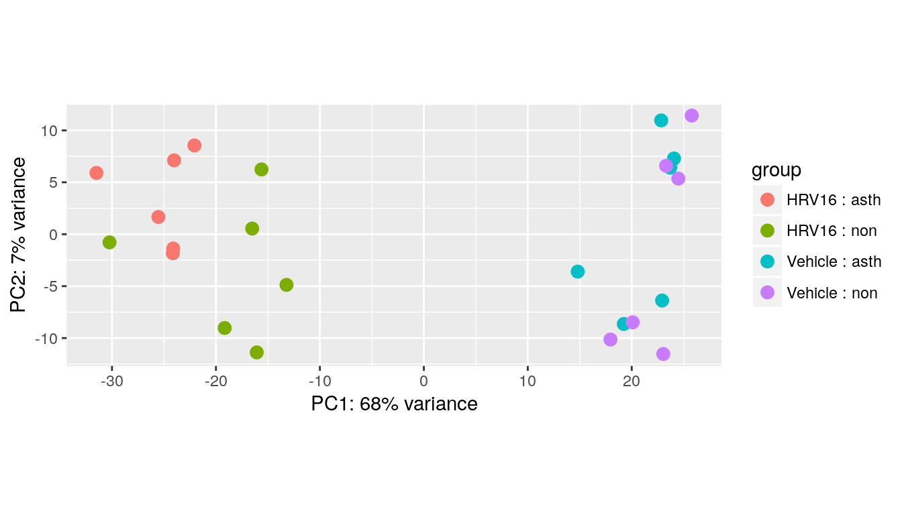

# Re-arrange sample info


```r
dds$id <- substr(dds$title, 1, 3)
id.lvls <- c(dds$id[dds$condition == "non" & dds$treatment == "Vehicle"],
             dds$id[dds$condition == "asth" & dds$treatment == "Vehicle"])
```


```r
dds$id %<>% factor(id.lvls)
o <- order(dds$condition, dds$treatment, dds$id)
dds <- dds[,o]
```


```r
as.data.frame(colData(dds)[c("condition","treatment","id")])
```

```
##            condition treatment  id
## SRR1565944       non   Vehicle s21
## SRR1565945       non   Vehicle s23
## SRR1565946       non   Vehicle s20
## SRR1565947       non   Vehicle s22
## SRR1565948       non   Vehicle s11
## SRR1565949       non   Vehicle s30
## SRR1565943       non     HRV16 s21
## SRR1565939       non     HRV16 s23
## SRR1565940       non     HRV16 s20
## SRR1565942       non     HRV16 s22
## SRR1565941       non     HRV16 s11
## SRR1565938       non     HRV16 s30
## SRR1565932      asth   Vehicle s28
## SRR1565933      asth   Vehicle s12
## SRR1565934      asth   Vehicle s26
## SRR1565935      asth   Vehicle s15
## SRR1565936      asth   Vehicle s18
## SRR1565937      asth   Vehicle s14
## SRR1565928      asth     HRV16 s28
## SRR1565926      asth     HRV16 s12
## SRR1565931      asth     HRV16 s26
## SRR1565930      asth     HRV16 s15
## SRR1565929      asth     HRV16 s18
## SRR1565927      asth     HRV16 s14
```

```r
all(dds$id == c(rep(id.lvls[1:6], 2),
                rep(id.lvls[7:12], 2)))
```

```
## [1] TRUE
```


```r
dds$id.nested <- factor(rep(1:6,4))
as.data.frame(colData(dds)[c("condition","treatment","id","id.nested")])
```

```
##            condition treatment  id id.nested
## SRR1565944       non   Vehicle s21         1
## SRR1565945       non   Vehicle s23         2
## SRR1565946       non   Vehicle s20         3
## SRR1565947       non   Vehicle s22         4
## SRR1565948       non   Vehicle s11         5
## SRR1565949       non   Vehicle s30         6
## SRR1565943       non     HRV16 s21         1
## SRR1565939       non     HRV16 s23         2
## SRR1565940       non     HRV16 s20         3
## SRR1565942       non     HRV16 s22         4
## SRR1565941       non     HRV16 s11         5
## SRR1565938       non     HRV16 s30         6
## SRR1565932      asth   Vehicle s28         1
## SRR1565933      asth   Vehicle s12         2
## SRR1565934      asth   Vehicle s26         3
## SRR1565935      asth   Vehicle s15         4
## SRR1565936      asth   Vehicle s18         5
## SRR1565937      asth   Vehicle s14         6
## SRR1565928      asth     HRV16 s28         1
## SRR1565926      asth     HRV16 s12         2
## SRR1565931      asth     HRV16 s26         3
## SRR1565930      asth     HRV16 s15         4
## SRR1565929      asth     HRV16 s18         5
## SRR1565927      asth     HRV16 s14         6
```


```r
design(dds) <- ~condition + condition:id.nested +
  treatment + condition:treatment
```


```r
rownames(dds) <- make.unique(substr(rownames(dds),1,15))
```

# Differential gene expression


```r
dds <- dds[rowSums(counts(dds)) > 0,]
keep <- rowSums(counts(dds) >= 10) >= 3
table(keep)
```

```
## keep
## FALSE  TRUE 
## 20042 11227
```

```r
dds <- dds[keep,]
```


```r
dds <- DESeq(dds)
```

```
## estimating size factors
```

```
## using 'avgTxLength' from assays(dds), correcting for library size
```

```
## estimating dispersions
```

```
## gene-wise dispersion estimates
```

```
## mean-dispersion relationship
```

```
## final dispersion estimates
```

```
## fitting model and testing
```

```r
resultsNames(dds)
```

```
##  [1] "Intercept"                    "condition_asth_vs_non"       
##  [3] "treatment_HRV16_vs_Vehicle"   "conditionnon.id.nested2"     
##  [5] "conditionasth.id.nested2"     "conditionnon.id.nested3"     
##  [7] "conditionasth.id.nested3"     "conditionnon.id.nested4"     
##  [9] "conditionasth.id.nested4"     "conditionnon.id.nested5"     
## [11] "conditionasth.id.nested5"     "conditionnon.id.nested6"     
## [13] "conditionasth.id.nested6"     "conditionasth.treatmentHRV16"
```

```r
res <- results(dds)
res.sort <- res[order(res$pvalue),]
```


```r
plotMA(res, ylim=c(-5,5))
```

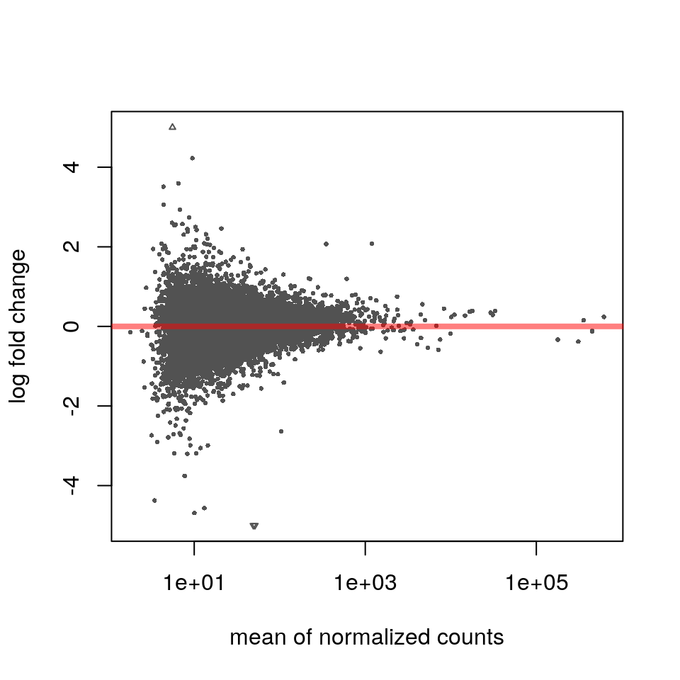


```r
summary(res)
```

```
## 
## out of 11227 with nonzero total read count
## adjusted p-value < 0.1
## LFC > 0 (up)     : 0, 0% 
## LFC < 0 (down)   : 0, 0% 
## outliers [1]     : 0, 0% 
## low counts [2]   : 0, 0% 
## (mean count < 2)
## [1] see 'cooksCutoff' argument of ?results
## [2] see 'independentFiltering' argument of ?results
```


```r
top.gene <- rownames(res.sort)[1]
plotCounts(dds, top.gene, c("condition","treatment"), transform=FALSE)
```

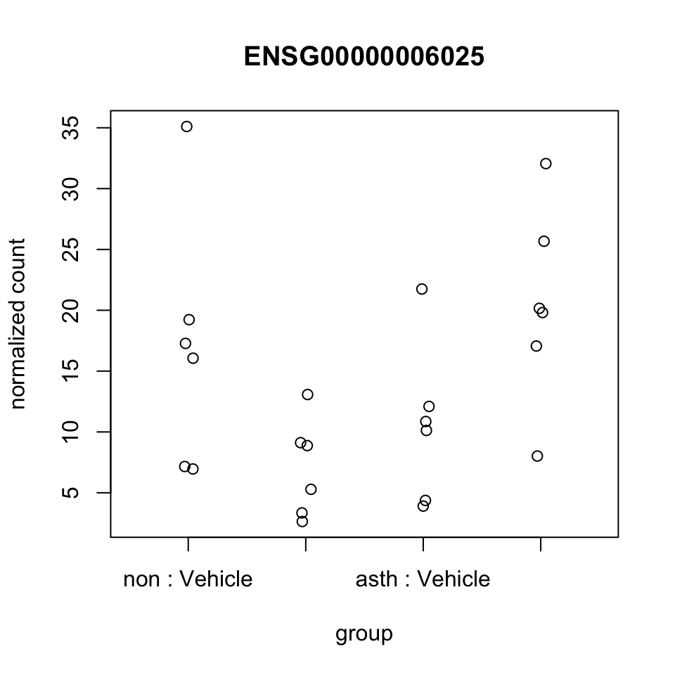

# Exploring results


```r
library(Homo.sapiens)
```

```
## Loading required package: AnnotationDbi
```

```
## Loading required package: OrganismDbi
```

```
## Loading required package: GenomicFeatures
```

```
## Loading required package: GO.db
```

```
## 
```

```
## Loading required package: org.Hs.eg.db
```

```
## 
```

```
## Loading required package: TxDb.Hsapiens.UCSC.hg19.knownGene
```

```r
Homo.sapiens %>% mapIds(top.gene, "SYMBOL", "ENSEMBL")
```

```
## 'select()' returned 1:1 mapping between keys and columns
```

```
## ENSG00000006025 
##        "OSBPL7"
```

```r
go.tab <- Homo.sapiens %>% AnnotationDbi::select(top.gene, "GOID", "ENSEMBL") %>% subset(ONTOLOGY == "BP")
```

```
## 'select()' returned 1:many mapping between keys and columns
```

```r
# Homo.sapiens %>% AnnotationDbi::select(go.tab$GOID, "TERM", "GOID")
```


```r
target <- c("CCL5","CXCL10","CX3CL1","ACKR4","CDHR3")
target.map <- mapIds(Homo.sapiens, target, "ENSEMBL", "SYMBOL")
```

```
## 'select()' returned 1:many mapping between keys and columns
```

```r
target.map
```

```
##              CCL5            CXCL10            CX3CL1             ACKR4 
## "ENSG00000271503" "ENSG00000169245" "ENSG00000006210" "ENSG00000129048" 
##             CDHR3 
## "ENSG00000128536"
```

```r
match(target.map, rownames(res.sort))
```

```
## [1] 2747  253 4704  335 8628
```


```r
plotCounts(dds, target.map[2], c("condition","treatment"))
```

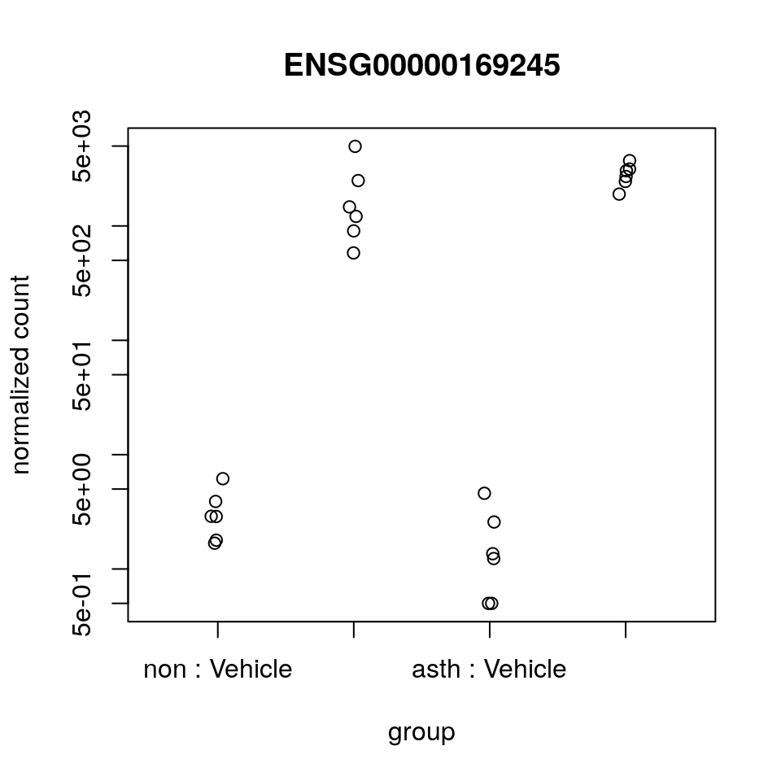

```r
plotCounts(dds, target.map[2], c("condition","treatment"), transform=FALSE)
```

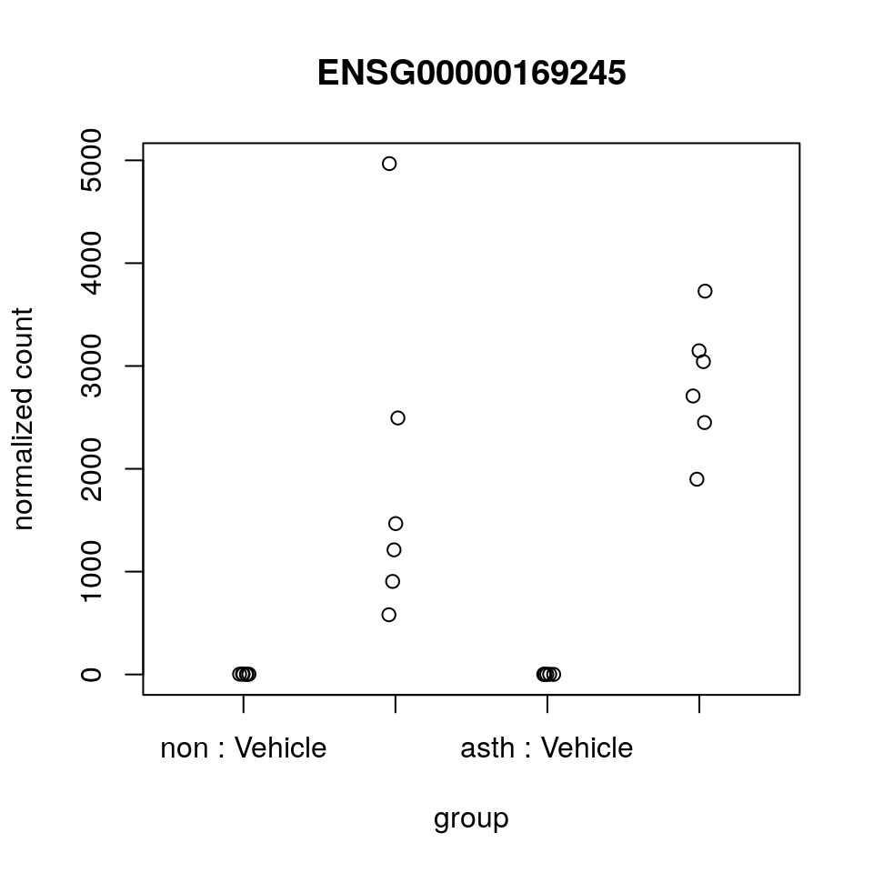


```r
dat <- plotCounts(dds, target.map[2], c("condition","treatment","id.nested"),
                  returnData=TRUE)
```


```r
library(ggplot2)
ggplot(dat, aes(x=treatment, y=count, col=id.nested, group=id.nested)) +
  geom_point() + geom_smooth(method="lm") +
  scale_y_log10() + 
  facet_wrap(~condition)
```

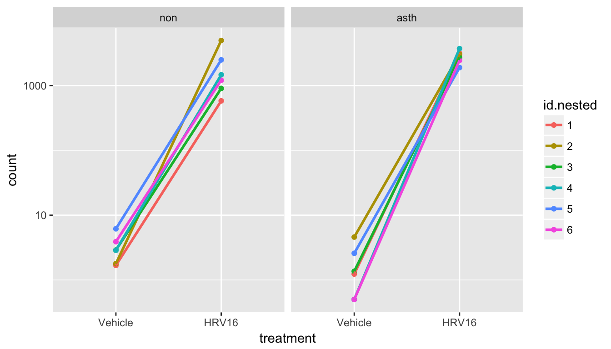

# Interlude: power analysis


```r
plotDispEsts(dds, ylim=c(1e-4,10))
```

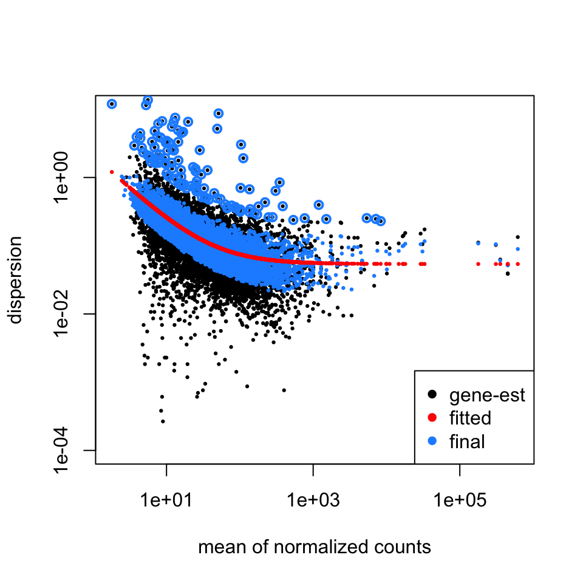


```r
dispersionFunction(dds)
```

```
## function (q) 
## coefs[1] + coefs[2]/q
## <bytecode: 0x55f1894c5c68>
## <environment: 0x55f18a035c88>
## attr(,"coefficients")
## asymptDisp  extraPois 
## 0.05393587 2.06449016 
## attr(,"fitType")
## [1] "parametric"
## attr(,"varLogDispEsts")
## [1] 0.5016665
## attr(,"dispPriorVar")
## [1] 0.2803435
```

```r
dmr <- function(x) (.05 + 2.06 / x) * exp(rnorm(length(x),0,.28))
baseMean <- mcols(dds)$baseMean
```


```r
plot(baseMean, dmr(baseMean), log="xy", ylim=c(1e-4,10))
```

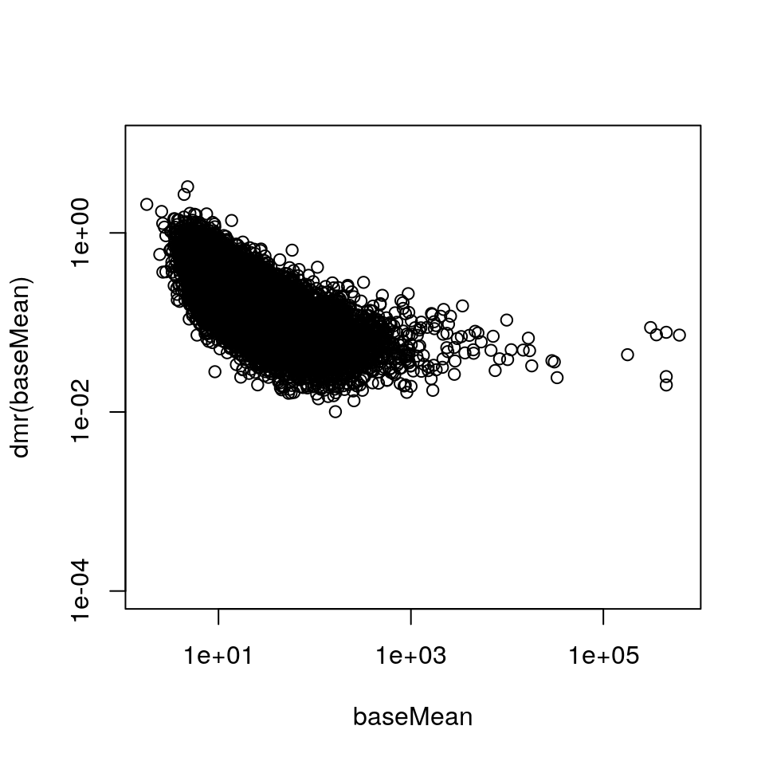


```r
mean(log2(baseMean))
```

```
## [1] 4.802675
```

```r
sd(log2(baseMean))
```

```
## [1] 1.665009
```


```r
set.seed(1)
sim <- makeExampleDESeqDataSet(n=10000, m=12,
                               betaSD=1,
                               interceptMean=5,
                               interceptSD=2,
                               dispMeanRel=dmr)
keep <- rowSums(counts(sim) >= 10) >= 3
table(keep)
```

```
## keep
## FALSE  TRUE 
##  1249  8751
```

```r
sim <- sim[keep,]
sim <- DESeq(sim)
```

```
## estimating size factors
```

```
## estimating dispersions
```

```
## gene-wise dispersion estimates
```

```
## mean-dispersion relationship
```

```
## final dispersion estimates
```

```
## fitting model and testing
```

```r
sim.res <- results(sim, independentFiltering=FALSE, cooksCutoff=FALSE)
```


```r
par(mfrow=c(1,2))
plotMA(res, xlim=c(1,1e6), ylim=c(-5,5))
plotMA(sim.res, xlim=c(1,1e6), ylim=c(-5,5))
```

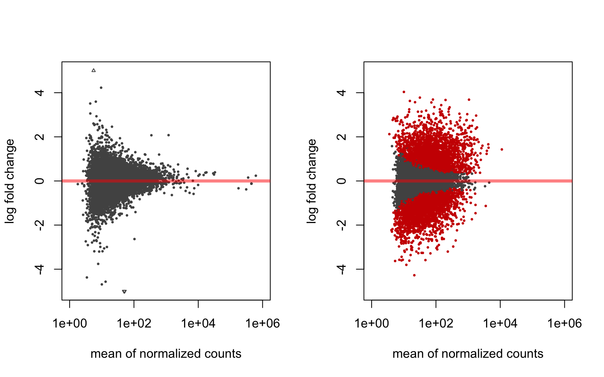


```r
max.lfc <- ceiling(max(abs(mcols(sim)$trueBeta)))
sim.dat <- data.frame(sig=sim.res$padj < .1,
                      log2mean=cut(mcols(sim)$trueIntercept,c(-1,3.3,6.6,10,20)),
                      abs.lfc=cut(abs(mcols(sim)$trueBeta),c(0,.25,.5,1,max.lfc)))
```


```r
library(dplyr) 
sim.tab <- sim.dat %>% group_by(log2mean, abs.lfc) %>% summarize(power=mean(sig))
```


```r
ggplot(sim.tab, aes(x=abs.lfc, y=power, col=log2mean, group=log2mean)) + geom_line()
```

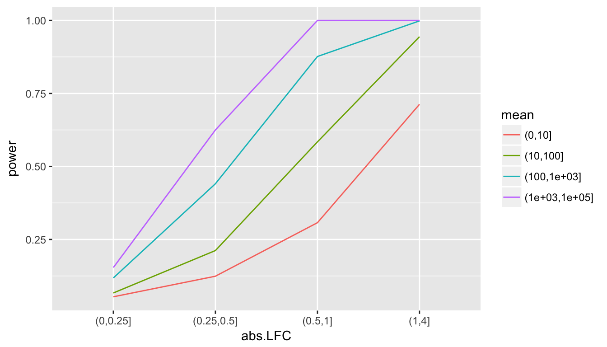

# Empirical and nominal FDR


```r
de <- rep(c(FALSE,TRUE),c(8000,2000))
set.seed(1)
sim2 <- makeExampleDESeqDataSet(n=10000, m=12,
                                betaSD=ifelse(de,1,0),
                                interceptMean=6,
                                interceptSD=3,
                                dispMeanRel=dmr)
sim2 <- DESeq(sim2)
```

```
## estimating size factors
```

```
## estimating dispersions
```

```
## gene-wise dispersion estimates
```

```
## mean-dispersion relationship
```

```
## final dispersion estimates
```

```
## fitting model and testing
```

```r
threshold <- c(1,5,10,15,20)/100
FDR <- sapply(threshold, function(t) {
  sim2.res <- results(sim2, alpha=t)
  sig <- which(sim2.res$padj < t)
  mean(!de[sig])
})
```


```r
plot(threshold, FDR, ylim=c(0,.3), type="b", col="blue",
     main="Empirical vs nominal FDR")
abline(0,1)
```

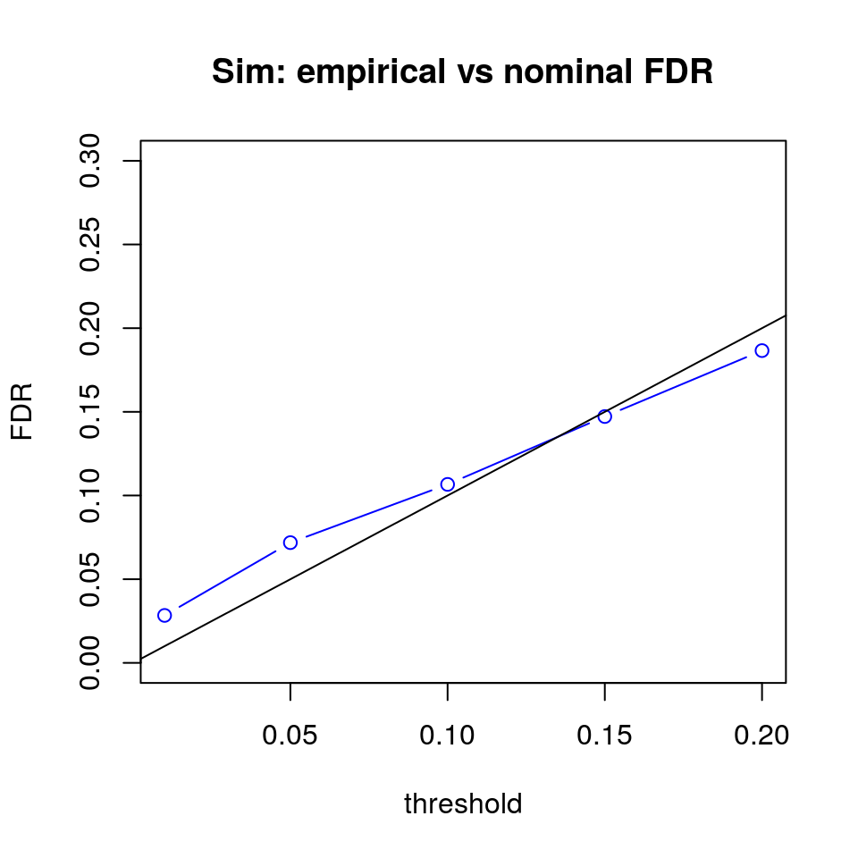

# Other differential analyses


```r
dds2 <- removeResults(dds)
design(dds2) <- ~condition + treatment + condition:id.nested
dds2 <- DESeq(dds2)
```

```
## using pre-existing normalization factors
```

```
## estimating dispersions
```

```
## found already estimated dispersions, replacing these
```

```
## gene-wise dispersion estimates
```

```
## mean-dispersion relationship
```

```
## final dispersion estimates
```

```
## fitting model and testing
```

```r
resultsNames(dds2)
```

```
##  [1] "Intercept"                  "condition_asth_vs_non"     
##  [3] "treatment_HRV16_vs_Vehicle" "conditionnon.id.nested2"   
##  [5] "conditionasth.id.nested2"   "conditionnon.id.nested3"   
##  [7] "conditionasth.id.nested3"   "conditionnon.id.nested4"   
##  [9] "conditionasth.id.nested4"   "conditionnon.id.nested5"   
## [11] "conditionasth.id.nested5"   "conditionnon.id.nested6"   
## [13] "conditionasth.id.nested6"
```

```r
res2 <- results(dds2, name=c("treatment_HRV16_vs_Vehicle"))
res2 <- results(dds2, contrast=c("treatment","HRV16","Vehicle"))
```


```r
plotMA(res2, ylim=c(-10,10))
```

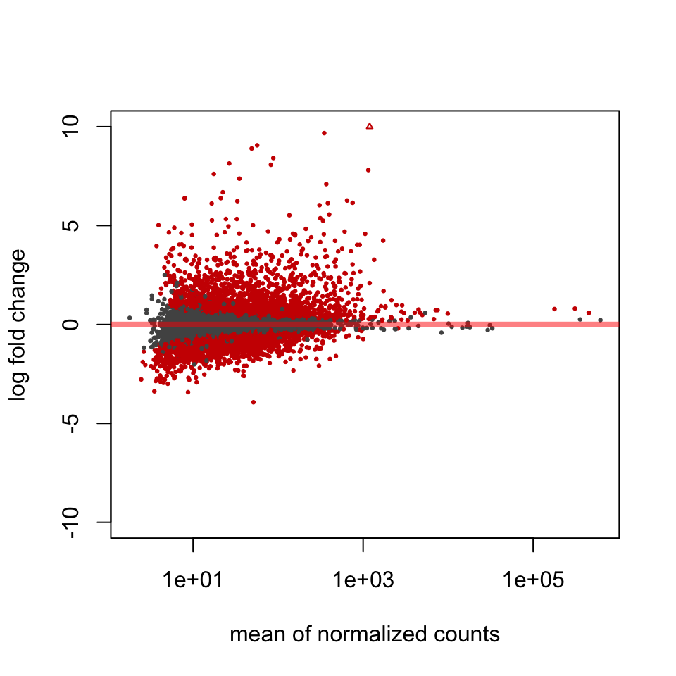


```r
summary(res2)
```

```
## 
## out of 11227 with nonzero total read count
## adjusted p-value < 0.1
## LFC > 0 (up)     : 2240, 20% 
## LFC < 0 (down)   : 2429, 22% 
## outliers [1]     : 0, 0% 
## low counts [2]   : 0, 0% 
## (mean count < 2)
## [1] see 'cooksCutoff' argument of ?results
## [2] see 'independentFiltering' argument of ?results
```


```r
res2.sort <- res2[order(res2$log2FoldChange, decreasing=TRUE),]
Homo.sapiens %>% mapIds(rownames(res2.sort)[1:40],
                        "SYMBOL", "ENSEMBL")
```

```
## 'select()' returned 1:many mapping between keys and columns
```

```
## ENSG00000169245 ENSG00000169248 ENSG00000182393 ENSG00000183709 
##        "CXCL10"        "CXCL11"         "IFNL1"         "IFNL2" 
## ENSG00000138755 ENSG00000197110 ENSG00000271503 ENSG00000119922 
##         "CXCL9"         "IFNL3"          "CCL5"         "IFIT2" 
## ENSG00000226025 ENSG00000124256 ENSG00000135114 ENSG00000102524 
##      "LGALS17A"          "ZBP1"          "OASL"      "TNFSF13B" 
## ENSG00000215115 ENSG00000007171 ENSG00000215113 ENSG00000185745 
##       "CXorf49"          "NOS2"      "CXorf49B"         "IFIT1" 
## ENSG00000104951 ENSG00000119917 ENSG00000187608 ENSG00000185338 
##         "IL4I1"         "IFIT3"         "ISG15"         "SOCS1" 
## ENSG00000131203 ENSG00000134321 ENSG00000128383 ENSG00000107201 
##          "IDO1"         "RSAD2"      "APOBEC3A"         "DDX58" 
## ENSG00000010030 ENSG00000124391 ENSG00000232810 ENSG00000162654 
##          "ETV7"         "IL17C"           "TNF"          "GBP4" 
## ENSG00000089692 ENSG00000182487 ENSG00000138646 ENSG00000146192 
##          "LAG3"         "NCF1B"         "HERC5"          "FGD2" 
## ENSG00000144596 ENSG00000115267 ENSG00000168062 ENSG00000183486 
##         "GRIP2"         "IFIH1"         "BATF2"           "MX2" 
## ENSG00000167916 ENSG00000165178 ENSG00000117013 ENSG00000137198 
##         "KRT24"         "NCF1C"         "KCNQ4"          "GMPR"
```

# Exploring results with annotation


```r
match(target.map, rownames(res2.sort))
```

```
## [1]     7     1    94   268 11063
```

```r
go.tab <- Homo.sapiens %>% AnnotationDbi::select(rownames(res2.sort)[1],
                                  "GO", "ENSEMBL") %>% subset(ONTOLOGY == "BP")
```

```
## 'select()' returned 1:many mapping between keys and columns
```


```r
library(GO.db)
go.tab2 <- GO.db %>% AnnotationDbi::select(go.tab$GO, "TERM", "GOID")
```

```
## 'select()' returned 1:1 mapping between keys and columns
```

```r
substr(go.tab2$TERM, 1, 60)
```

```
##  [1] "chemotaxis"                                                  
##  [2] "inflammatory response"                                       
##  [3] "immune response"                                             
##  [4] "signal transduction"                                         
##  [5] "cell surface receptor signaling pathway"                     
##  [6] "G-protein coupled receptor signaling pathway"                
##  [7] "cell-cell signaling"                                         
##  [8] "muscle organ development"                                    
##  [9] "blood circulation"                                           
## [10] "positive regulation of cell proliferation"                   
## [11] "response to cold"                                            
## [12] "response to gamma radiation"                                 
## [13] "T cell chemotaxis"                                           
## [14] "regulation of T cell chemotaxis"                             
## [15] "response to auditory stimulus"                               
## [16] "negative regulation of angiogenesis"                         
## [17] "positive regulation of cAMP metabolic process"               
## [18] "response to vitamin D"                                       
## [19] "cellular response to heat"                                   
## [20] "endothelial cell activation"                                 
## [21] "regulation of cell proliferation"                            
## [22] "positive regulation of cAMP-mediated signaling"              
## [23] "negative regulation of myoblast differentiation"             
## [24] "regulation of protein kinase activity"                       
## [25] "positive regulation of transcription from RNA polymerase II "
## [26] "positive regulation of release of sequestered calcium ion in"
## [27] "defense response to virus"                                   
## [28] "chemokine-mediated signaling pathway"                        
## [29] "cellular response to lipopolysaccharide"                     
## [30] "positive regulation of monocyte chemotaxis"                  
## [31] "regulation of endothelial tube morphogenesis"                
## [32] "negative regulation of myoblast fusion"                      
## [33] "positive regulation of T cell migration"
```

```r
getTerms <- function(n) {
  go.tab <- Homo.sapiens %>% AnnotationDbi::select(rownames(res2.sort)[n],
                                    "GO", "ENSEMBL") %>% subset(ONTOLOGY == "BP")
  go.tab2 <- Homo.sapiens %>% AnnotationDbi::select(go.tab$GO, "TERM", "GOID")
  substr(go.tab2$TERM, 1, 60)
}
```


```r
getTerms(2)
```

```
## 'select()' returned 1:many mapping between keys and columns
```

```
## 'select()' returned 1:1 mapping between keys and columns
```

```
##  [1] "positive regulation of leukocyte chemotaxis"                 
##  [2] "chemotaxis"                                                  
##  [3] "inflammatory response"                                       
##  [4] "immune response"                                             
##  [5] "signal transduction"                                         
##  [6] "G-protein coupled receptor signaling pathway"                
##  [7] "cell-cell signaling"                                         
##  [8] "T cell chemotaxis"                                           
##  [9] "positive regulation of cAMP metabolic process"               
## [10] "response to lipopolysaccharide"                              
## [11] "regulation of cell proliferation"                            
## [12] "positive regulation of cAMP-mediated signaling"              
## [13] "positive regulation of release of sequestered calcium ion in"
## [14] "chemokine-mediated signaling pathway"
```

```r
getTerms(3)
```

```
## 'select()' returned 1:many mapping between keys and columns
## 'select()' returned 1:1 mapping between keys and columns
```

```
##  [1] "negative regulation of type 2 immune response"               
##  [2] "JAK-STAT cascade"                                            
##  [3] "negative regulation of cell proliferation"                   
##  [4] "negative regulation of interleukin-13 production"            
##  [5] "negative regulation of interleukin-5 production"             
##  [6] "positive regulation of interferon-gamma production"          
##  [7] "positive regulation of tyrosine phosphorylation of STAT prot"
##  [8] "negative regulation of memory T cell differentiation"        
##  [9] "innate immune response"                                      
## [10] "positive regulation of MHC class I biosynthetic process"     
## [11] "negative regulation of T cell differentiation"               
## [12] "negative regulation of transcription, DNA-templated"         
## [13] "positive regulation of transcription, DNA-templated"         
## [14] "positive regulation of JAK-STAT cascade"                     
## [15] "positive regulation of immune response"                      
## [16] "defense response to virus"
```

```r
getTerms(4)
```

```
## 'select()' returned 1:many mapping between keys and columns
```

```
## 'select()' returned many:1 mapping between keys and columns
```

```
## [1] "mucosal immune response"               
## [2] "JAK-STAT cascade"                      
## [3] "innate immune response"                
## [4] "positive regulation of immune response"
## [5] "regulation of T cell activation"       
## [6] "defense response to virus"             
## [7] "defense response to virus"
```

```r
getTerms(5)
```

```
## 'select()' returned 1:many mapping between keys and columns
```

```
## 'select()' returned 1:1 mapping between keys and columns
```

```
##  [1] "positive regulation of leukocyte chemotaxis"                 
##  [2] "chemotaxis"                                                  
##  [3] "defense response"                                            
##  [4] "inflammatory response"                                       
##  [5] "immune response"                                             
##  [6] "cellular defense response"                                   
##  [7] "signal transduction"                                         
##  [8] "G-protein coupled receptor signaling pathway"                
##  [9] "cell-cell signaling"                                         
## [10] "T cell chemotaxis"                                           
## [11] "positive regulation of cAMP metabolic process"               
## [12] "response to lipopolysaccharide"                              
## [13] "regulation of cell proliferation"                            
## [14] "positive regulation of cAMP-mediated signaling"              
## [15] "positive regulation of myoblast differentiation"             
## [16] "positive regulation of release of sequestered calcium ion in"
## [17] "defense response to virus"                                   
## [18] "chemokine-mediated signaling pathway"                        
## [19] "positive regulation of myoblast fusion"
```

```r
getTerms(6)
```

```
## 'select()' returned 1:many mapping between keys and columns
```

```
## 'select()' returned many:1 mapping between keys and columns
```

```
## [1] "JAK-STAT cascade"                                         
## [2] "negative regulation of viral genome replication"          
## [3] "innate immune response"                                   
## [4] "positive regulation of immune response"                   
## [5] "regulation of T cell activation"                          
## [6] "defense response to virus"                                
## [7] "defense response to virus"                                
## [8] "positive regulation of protein targeting to mitochondrion"
```

```r
getTerms(7)
```

```
## 'select()' returned 1:many mapping between keys and columns
## 'select()' returned many:1 mapping between keys and columns
```

```
##  [1] "MAPK cascade"                                                
##  [2] "dendritic cell chemotaxis"                                   
##  [3] "monocyte chemotaxis"                                         
##  [4] "regulation of chronic inflammatory response"                 
##  [5] "calcium ion transport"                                       
##  [6] "cellular calcium ion homeostasis"                            
##  [7] "exocytosis"                                                  
##  [8] "chemotaxis"                                                  
##  [9] "inflammatory response"                                       
## [10] "leukocyte cell-cell adhesion"                                
## [11] "G-protein coupled receptor signaling pathway"                
## [12] "cell-cell signaling"                                         
## [13] "response to virus"                                           
## [14] "response to toxic substance"                                 
## [15] "positive regulation of activation of JAK2 kinase activity"   
## [16] "positive regulation of macrophage chemotaxis"                
## [17] "positive regulation of T cell chemotaxis"                    
## [18] "positive regulation of phosphatidylinositol 3-kinase signali"
## [19] "positive regulation of smooth muscle cell migration"         
## [20] "positive regulation of cell migration"                       
## [21] "neutrophil chemotaxis"                                       
## [22] "positive regulation of cellular biosynthetic process"        
## [23] "activation of phospholipase D activity"                      
## [24] "lipopolysaccharide-mediated signaling pathway"               
## [25] "positive regulation of cell-cell adhesion mediated by integr"
## [26] "positive regulation of homotypic cell-cell adhesion"         
## [27] "positive regulation of T cell proliferation"                 
## [28] "neutrophil activation"                                       
## [29] "positive regulation of phosphorylation"                      
## [30] "positive regulation of tyrosine phosphorylation of STAT prot"
## [31] "protein kinase B signaling"                                  
## [32] "positive regulation of GTPase activity"                      
## [33] "cellular protein complex assembly"                           
## [34] "negative regulation by host of viral transcription"          
## [35] "cellular response to fibroblast growth factor stimulus"      
## [36] "positive regulation of viral genome replication"             
## [37] "negative regulation of viral genome replication"             
## [38] "positive regulation of innate immune response"               
## [39] "negative regulation of G-protein coupled receptor protein si"
## [40] "positive regulation of cell adhesion"                        
## [41] "positive regulation of translational initiation"             
## [42] "positive regulation of JAK-STAT cascade"                     
## [43] "eosinophil chemotaxis"                                       
## [44] "macrophage chemotaxis"                                       
## [45] "positive regulation of smooth muscle cell proliferation"     
## [46] "positive regulation of epithelial cell proliferation"        
## [47] "regulation of insulin secretion"                             
## [48] "regulation of T cell activation"                             
## [49] "positive chemotaxis"                                         
## [50] "protein tetramerization"                                     
## [51] "positive regulation of calcium ion transport"                
## [52] "positive regulation of protein tyrosine kinase activity"     
## [53] "chemokine-mediated signaling pathway"                        
## [54] "chemokine-mediated signaling pathway"                        
## [55] "negative regulation of chemokine-mediated signaling pathway" 
## [56] "negative regulation of T cell apoptotic process"             
## [57] "positive regulation of T cell apoptotic process"             
## [58] "positive regulation of ERK1 and ERK2 cascade"                
## [59] "cellular response to interferon-gamma"                       
## [60] "cellular response to interleukin-1"                          
## [61] "cellular response to tumor necrosis factor"                  
## [62] "cellular response to organic cyclic compound"                
## [63] "positive regulation of monocyte chemotaxis"                  
## [64] "regulation of neuron death"                                  
## [65] "negative regulation of macrophage apoptotic process"         
## [66] "positive regulation of T cell migration"                     
## [67] "positive regulation of natural killer cell chemotaxis"
```

```r
getTerms(8)
```

```
## 'select()' returned 1:many mapping between keys and columns
## 'select()' returned many:1 mapping between keys and columns
```

```
## [1] "apoptotic mitochondrial changes"         
## [2] "response to virus"                       
## [3] "response to virus"                       
## [4] "negative regulation of protein binding"  
## [5] "cellular response to interferon-alpha"   
## [6] "positive regulation of apoptotic process"
## [7] "defense response to virus"               
## [8] "type I interferon signaling pathway"
```

# LFC shrinkage


```r
dds3 <- removeResults(dds)
design(dds3) <- ~condition + treatment
```


```r
dds3 <- DESeq(dds3)
```

```
## using pre-existing normalization factors
```

```
## estimating dispersions
```

```
## found already estimated dispersions, replacing these
```

```
## gene-wise dispersion estimates
```

```
## mean-dispersion relationship
```

```
## final dispersion estimates
```

```
## fitting model and testing
```

```r
resultsNames(dds3)
```

```
## [1] "Intercept"                  "condition_asth_vs_non"     
## [3] "treatment_HRV16_vs_Vehicle"
```

```r
res3 <- results(dds3, lfcThreshold=2)
res3shr <- lfcShrink(dds3, coef=3, res=res3)
```


```r
par(mfrow=c(1,2))
plotMA(res3, ylim=c(-12,12))
rs <- rowSums(counts(dds)[,dds$treatment == "Vehicle"])
with(res3[rs < 12,], points(baseMean, log2FoldChange, cex=2, col="dodgerblue"))
plotMA(res3shr, ylim=c(-12,12))
with(res3shr[rs < 12,], points(baseMean, log2FoldChange, cex=2, col="dodgerblue"))
```

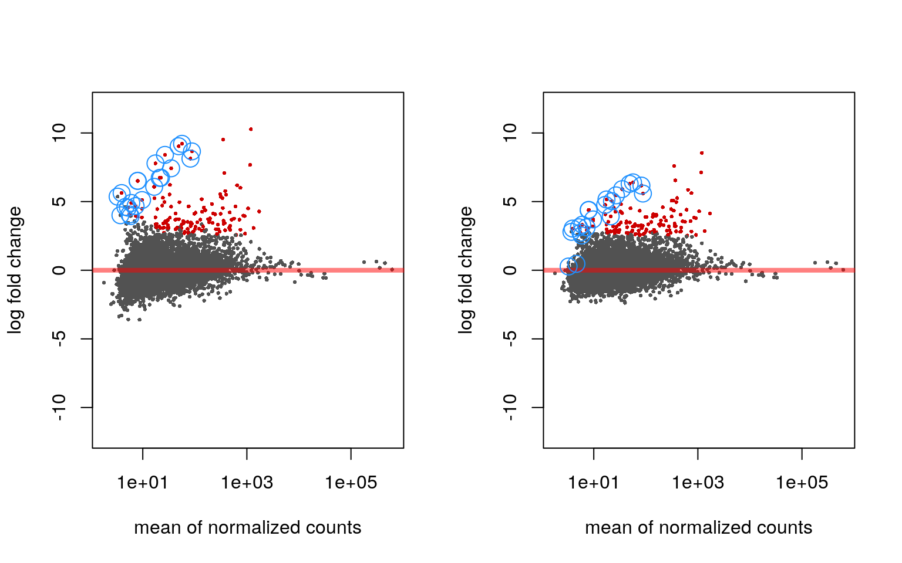


```r
sessionInfo()
```

```
## R version 3.4.0 (2017-04-21)
## Platform: x86_64-pc-linux-gnu (64-bit)
## Running under: Ubuntu 16.10
## 
## Matrix products: default
## BLAS: /usr/lib/libblas/libblas.so.3.6.1
## LAPACK: /usr/lib/lapack/liblapack.so.3.6.1
## 
## locale:
##  [1] LC_CTYPE=en_US.UTF-8       LC_NUMERIC=C              
##  [3] LC_TIME=en_US.UTF-8        LC_COLLATE=en_US.UTF-8    
##  [5] LC_MONETARY=en_US.UTF-8    LC_MESSAGES=en_US.UTF-8   
##  [7] LC_PAPER=en_US.UTF-8       LC_NAME=C                 
##  [9] LC_ADDRESS=C               LC_TELEPHONE=C            
## [11] LC_MEASUREMENT=en_US.UTF-8 LC_IDENTIFICATION=C       
## 
## attached base packages:
## [1] parallel  stats4    stats     graphics  grDevices datasets  utils    
## [8] methods   base     
## 
## other attached packages:
##  [1] bindrcpp_0.2                           
##  [2] dplyr_0.7.1                            
##  [3] ggplot2_2.2.1                          
##  [4] Homo.sapiens_1.3.1                     
##  [5] TxDb.Hsapiens.UCSC.hg19.knownGene_3.2.2
##  [6] org.Hs.eg.db_3.4.1                     
##  [7] GO.db_3.4.1                            
##  [8] OrganismDbi_1.19.0                     
##  [9] GenomicFeatures_1.29.6                 
## [10] AnnotationDbi_1.39.0                   
## [11] DESeq2_1.17.3                          
## [12] SummarizedExperiment_1.7.2             
## [13] DelayedArray_0.3.6                     
## [14] matrixStats_0.52.2                     
## [15] Biobase_2.37.2                         
## [16] GenomicRanges_1.29.4                   
## [17] GenomeInfoDb_1.13.1                    
## [18] IRanges_2.11.3                         
## [19] S4Vectors_0.15.2                       
## [20] BiocGenerics_0.23.0                    
## [21] readr_1.1.1                            
## [22] tximport_1.5.0                         
## [23] rjson_0.2.15                           
## [24] rmarkdown_1.5                          
## [25] magrittr_1.5                           
## [26] knitr_1.16                             
## [27] devtools_1.13.1                        
## [28] BiocInstaller_1.27.2                   
## 
## loaded via a namespace (and not attached):
##  [1] bitops_1.0-6             RColorBrewer_1.1-2      
##  [3] progress_1.1.2           rprojroot_1.2           
##  [5] tools_3.4.0              backports_1.1.0         
##  [7] R6_2.2.1                 rpart_4.1-11            
##  [9] Hmisc_4.0-3              DBI_0.6-1               
## [11] lazyeval_0.2.0           colorspace_1.3-2        
## [13] nnet_7.3-12              withr_1.0.2             
## [15] gridExtra_2.2.1          prettyunits_1.0.2       
## [17] compiler_3.4.0           graph_1.55.0            
## [19] htmlTable_1.9            rtracklayer_1.37.2      
## [21] labeling_0.3             scales_0.4.1            
## [23] checkmate_1.8.2          genefilter_1.59.0       
## [25] RBGL_1.53.0              stringr_1.2.0           
## [27] digest_0.6.12            Rsamtools_1.29.0        
## [29] foreign_0.8-67           XVector_0.17.0          
## [31] pkgconfig_2.0.1          base64enc_0.1-3         
## [33] htmltools_0.3.6          htmlwidgets_0.8         
## [35] rlang_0.1.1              RSQLite_1.1-2           
## [37] bindr_0.1                BiocParallel_1.11.1     
## [39] acepack_1.4.1            RCurl_1.95-4.8          
## [41] GenomeInfoDbData_0.99.0  Formula_1.2-1           
## [43] Matrix_1.2-10            Rcpp_0.12.11            
## [45] munsell_0.4.3            stringi_1.1.5           
## [47] yaml_2.1.14              zlibbioc_1.23.0         
## [49] plyr_1.8.4               grid_3.4.0              
## [51] lattice_0.20-35          Biostrings_2.45.2       
## [53] splines_3.4.0            annotate_1.55.0         
## [55] hms_0.3                  locfit_1.5-9.1          
## [57] geneplotter_1.55.0       codetools_0.2-14        
## [59] biomaRt_2.33.3           glue_1.1.1              
## [61] XML_3.98-1.7             evaluate_0.10           
## [63] latticeExtra_0.6-28      data.table_1.10.4       
## [65] gtable_0.2.0             assertthat_0.2.0        
## [67] xtable_1.8-2             survival_2.41-3         
## [69] tibble_1.3.1             GenomicAlignments_1.13.2
## [71] memoise_1.1.0            cluster_2.0.6
```
